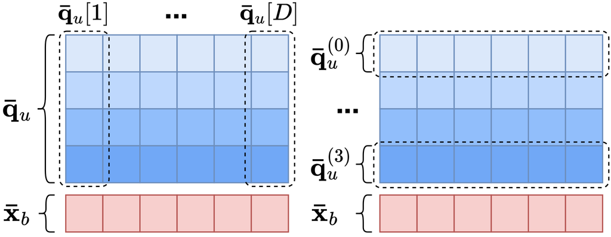
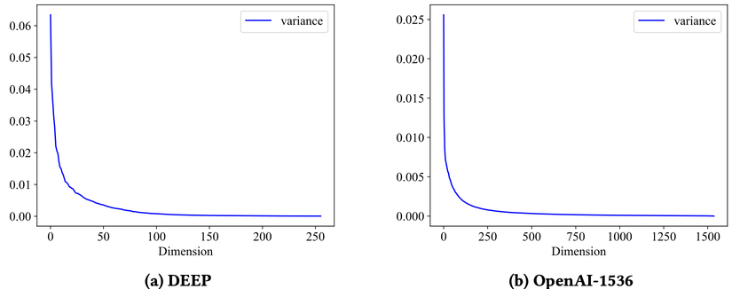
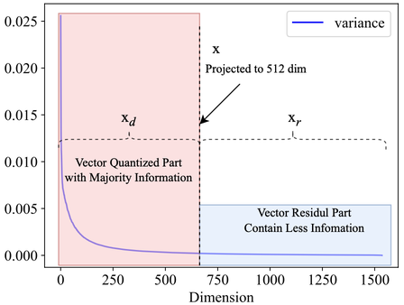

## 极致的二值量化方法— 深度解读 RaBitQ及其在 VSAG 上的工程实践

本文作者：@ShawnShawnYou @mingyu-hkustgz


# 1、前言


## （1）背景

向量检索是现代人工智能应用中的核心技术，广泛应用于 **`RAG（检索增强生成）`** 、**`搜索引擎`** 、**`推荐系统`** 等场景。随着深度学习的发展，高维向量变得越来越重要，因为它们能够有效捕捉数据的语义信息，为精准匹配和理解提供支持。在OpenAI最新的嵌入模型中，**将文本段嵌入成 1536 甚至更高到 3072 维的向量**。这对于向量检索过程引入了巨大的挑战。

挑战一：**`距离计算开销`**。在高维向量检索过程中，**距离计算占比超过 90%** 。这部分的计算复杂度随着维度的提升而提升。要提高检索应用的响应速度和吞吐，首要的就是降低距离计算开销。

挑战二：**`内存成本`**。如图1，对于包含 100W 条向量的 OpenAI-1536 数据集来说，每个向量由 1536 维的 32 位浮点数构成。**光是存储向量数据的成本已经需要 9.55GB** 。也就是说，即使是没有任何索引，也要求应用至少有 9.55GB 的内存占用，这是极大的挑战。


图 1 ：OpenAI-1536 数据集展示（来源 Huggingface ）


## （2）什么是量化

**`量化（Quantization）`** 是一种将高精度向量映射为低精度向量的技术。有多个好处：

1. ***计算速度快***
- 通过将高维浮点向量压缩为低精度表示（如从 32 位浮点数压缩到 4 位或 8 位整数），可以显著减少距离计算的开销。
- 使用量化可以将**距离计算速度提升 2 倍以上**，极大加速检索过程。

2. ***内存占用少***
- 压缩后的低精度向量占用更少的存储空间，从而大幅降低内存需求。

- 例如，使用 4-bit 标量量化时，内存占用仅为原始浮点向量的 **1/8** ，这对大规模数据集尤为重要。

  

## （3）极致的二值量化方法—RaBitQ 

**`RaBitQ`** 是南洋理工大学 Cheng LONG 老师及 Jianyang Gao 博士在数据库顶级会议 **`SIGMOD 2024`** 上发表的量化技术。其是一种新型的 **`二值（Binary）`** 量化方法，**能将向量的每一维表示从 float-32 压缩为 1-bit ，极限压缩 32 倍内存成本**。相比于传统的 PQ 和 SQ 量化，有以下几个好处：

1.  ***极致压缩比*** ：RaBitQ 将每一维用 0 或者 1 来表示，引入了高达 32 倍的极致量化压缩比。
2.  ***高精度*** ：通过组合随机旋转、残差量化、无偏估计器等策略，RaBitQ 在精度上媲美低压缩比的量化方法。
3.  ***与基于图的方法兼容*** ：相比于 PQ 对 FastScan 强依赖，RaBitQ 更容易适配于基于图的索引方法，并提供比 SQ 更高的量化精度和压缩比率。
4.  ***与基于倒排的方法兼容*** ：RaBitQ 也可以结合 FastScan ，从而在基于倒排的方法上也能获得高精度和高性能。

接下来，我们走入论文，细致解析为什么 RaBitQ 能在 **`极高压缩比`** 上达到 **`高精度`** 和 **`高性能`** 的效果。


# 2、RaBitQ 的核心竞争力

> 同样是二值量化，RaBitQ 的应用场景比朴素的二值量化有更长远的应用和研究价值。我们首先讨论二值量化这一思路的可行性，以及为什么朴素的二值量化不可行。

## （1）朴素的二值量化：可行性和局限性

 ***可行性：*** 我们以欧几里得距离（ L2 ）距离为例，给定维度 D 的两个向量 $x$ 和向量 $y$ ，其欧式距离如下：

$$ 
dis = \|x-y\|^2 = \sum_{d =1}^D(x[d]-y[d])^2 
$$

>  **例 1** 
> 如图 2 ，假设 $x=[1,1,1,...,1,1,1],y=[0,0,0...,0,0,0]$ ，容易计算出 $\|x-y\|^2 = 1000$ 。考虑第一维 $(x[1]-y[1] )^2= 1$ ，该维的信息对向量距离的贡献只有**千分之一**。而如果向量的维度只有 3 ，那么该维对向量距离的贡献是**三分之一**。


图 2 ：不同维度下维度对距离贡献示例

因此，针对低维向量，量化导致的每一维的信息损失对向量距离的更大。这限制了我们必须使用高精度的量化策略才能维持检索的准确度。而针对高维向量，**则可以使用更极端的量化策略**。因为即使是是造成了高量化损失，对最终的距离影响也不明显。这驱动我们可以在高维向量上使用二值量化。具体而言，二值量化直接使用向量每一维的符号作为该维的bit位表示，从而将 **`D 维向量`** 压缩成 **`D 位 bit 串`** 。大于零的部分采用 1 表示，反之采用 0 。例如对于 8 维向量 $x = [1, 1, -1,-1,1,1,-1,-1]$ ，则可以使用一个字节大小（8 bits）来表示： $\bar{x}=00110011_b$ （注：bit串最右是最低位）。

 ***局限性：*** 二值量化仍然引入了不小的量化损失。例如考虑另一个 8 维向量 。其虽然量化表示和  完全一致。但是这两个向量的每一维的**值域**完全不同（相差 100 倍）。而没有额外信息能指导如何从  解码还原。也就是说，二值量化仍然引入了较大的量化误差。RaBitQ引入了**三项核心技术**来解决这一误差问题。


## （2）RaBitQ 的三驾马车

> 在 RaBitQ 中，主要有三个核心思路来提高二值量化的可用性，分别是预处理，无偏估计和 bitwise 距离计算。

### （a）预处理

由于二值量化本身信息熵极小，向量维度之间的原始信息无法记录，精度损失较大。在几种情况下会有比较大影响：**维度间的方差，向量间的方差**。

为了解决这两个问题，RaBitQ 采用了一系列对向量的预处理：

a. ***随机旋转***：在二值量化前，先随机旋转原始向量。让不同维度的数据更加“均匀”，减少维度间的方差。
b. ***残差量化***：类似 IVFPQ 的残差量化，只处理原始向量和质心之间的残差向量。
c. ***归一化***：将残差向量归一化，使得其分布在单位球面上。为后续的处理提供强约束。
具体来说，假设原始入库向量为 $o_r$ ，查询向量为 $q_r$ ，质心为 $c$ 。计算两个向量的 L2 距离可以转化为：

$$
\|o_r-q_r\|^2 = \|(o_r-c)-(q_r-c)\|^2 \\
=\|o_r-c\|^2+\|q_r-c\|^2 - 2 \cdot \|o_r-c\|\cdot \|q_r-c\|\cdot < o,q >
$$

其中 $o=\frac{(o_r-c)}{\|(o_r-c)\|},q= \frac{(q_r-c)}{\|(q_r-c)\|}$ ，是归一化向量。 $\|o_r-c\|$ 和 $\|q_r-c\|$ 都可以预计算出，而不需要实时计算。从而距离计算问题被归约到$< o,q >$的内积计算问题。**内积计算即可通过二值量化后的向量来进行快速模拟**。

>  **例 2** 
> 假设 $\bar{o}=00110011_b,\bar{q} = 00110011_b$ 。那么内积即可通过两个比特串的与操作，并统计bit位为1的个数来得到距离。现代CPU通常提供了高效的popcnt指令来支持这一功能。

然而，使用比特与计算出的内积和原始向量内积不在一个空间。计算出的距离只是一个“标识”，能区分大小但是无法还原出完整的距离。


### （b）RaBitQ的精度核心：无偏估计

在RaBitQ中，用于将二值量化距离还原为真实距离的核心组件是无偏估计器。其保证了RaBitQ即使是在高压缩比下也有极佳的量化精度。
1.  ***二值码本*** ：对于二值向量，其中所有的1比特项被还原为 $+\frac{1}{\sqrt{D}}$ ，0比特项被还原为 $-\frac{1}{\sqrt{D}}$ 。这样还原的好处在于，还原后的向量模长为1。
2.  ***无偏估计器*** ：通过原文里一系列理论证明，可以通过 $\frac{< \bar{o}, q >}{< \bar{o}, o >}$ 来估计 $< o, q >$ 。其中， $\bar{o}$ 是一个底库向量的二值量化向量。同时， $< \bar{o}, o >$ 可以被预计算并存储。在计算时，只需要计算一个二值量化的向量和FP32表示的预处理后查询向量的距离即可。

**在向量索引的内存表示上，可以只存储比特编码的底库向量。在查询时，只需要使用无偏估计器来对比特编码的向量和预处理后的查询向量距离。** 从而能让 RaBitQ 既保持了极限的量化压缩比（从 FP32 压缩为 1 bit ），也保持了较高的量化精度。

>  **例 3** 
> 假设有底库向量 $o_r = [1, 1, -1,-1,1,1,-1,-1]$ ，质心 $c = [0, 0, 0,0,0,0,0,0]$ 。则通过归一化和残差预处理后有 $o = [0.353, 0.353, -0.353,-0.353,0.353,0.353,-0.353,-0.353]$ 。其使用二值量化后的结果为 $\bar{o}=00110011_b$ （注：bit串最右是最低位），还原成FP32表示后的向量为 $\bar{o} = [\frac{1}{\sqrt{8}}, \frac{1}{\sqrt{8}}, -\frac{1}{\sqrt{8}},-\frac{1}{\sqrt{8}},\frac{1}{\sqrt{8}}, \frac{1}{\sqrt{8}},-\frac{1}{\sqrt{8}},-\frac{1}{\sqrt{8}}]$ ，也就是 $\bar{o} = [0.353, 0.353, -0.353,-0.353,0.353,0.353,-0.353,-0.353]$ 。在建立索引阶段即可预计算出 $< \bar{o}, o > = 1.0$ 。
> 给定另一个查询向量 $q_r = [1, 1, -1,-1,1,1,-1,-1]$ 。则通过归一化和残差预处理后有 $q = [0.353, 0.353, -0.353,-0.353,0.353,0.353,-0.353,-0.353]$ 。在实时查询阶段可以计算出 $< \bar{o}, q> = 1.0$ 。从而，根据无偏估计器可以计算 $< o, q > = \frac{< \bar{o}, q >}{< \bar{o}, o >} = \frac{1.0}{1.0}=1.0$ 。
> $\|o_r-q_r\|^2 = \|(o_r-c)-(q_r-c)\|^2 \\
> =\|o_r-c\|^2+\|q_r-c\|^2 -2\cdot \|o_r-c\|\cdot \|q_r-c\|\cdot < o,q > \\
> =8 + 8 -2 * \sqrt{8}*\sqrt{8}*1.0=0$。
> 在这个情况下，直接使用原始的FP32表示的向量计算两个的L2距离是 $\|o_r-q_r\|^2 =0$ 。可以发现，**使用RaBitQ后在这个例子中的量化误差为0**。

然而，在计算时，仍然需要将向量还原为 FP32 的表示。这使得计算复杂度仍然和两个 FP32 的向量做计算没有差别。 RaBitQ 通过 bitwise 距离计算来对计算过程进行加速。


### （c）RaBitQ 的性能核心：bitwise 距离计算

在 RaBitQ 的二值量化处理后，底库向量已经都被量化为了比特串。所有的计算复杂度瓶颈都在查询向量上，因为其是 FP32 表示的。这一点和木桶效应相似，计算的瓶颈在 FP32 这一“长板”上。在结合 SIMD 中的 AVX512 指令集优化时，单条指令最多处理 512 位的数据。如果能降低向量每一维度的表示精度，从 32 位降低为 8 位或者更低。能在 AVX512 指令中一次处理更多的维度，从而显著加速计算。因此，可以引入标量量化来将查询向量量化为 INT4，INT8 等类型，降低计算复杂度。

以 4-bits 标量量化为例，当查询向量被量化到了每一维使用 4 位表示时。一条 AVX512 加载指令能比使用 32 位表示多加载 8 倍更多的维度！ **这表示计算吞吐的理论上限最高为 8 倍！** 在此基础上， **RaBitQ 创新性地提出了按比特纵向分解的 bitwise 距离计算算法** 。能高效计算一个二值量化的向量和标量量化向量的距离。



图 3 ：bitwise 计算示例

> **例 4** 
> 对于红色表示的二值向量和蓝色表示的 4-bits 量化向量。其中 4-bits 量化向量每一列对应了一个 4-bits 表示的维度值。一共有 D 维，所以有 D 列。固定第一列，从上到下每一行分别表示列 4 个位的值。我们以2维向量举例。例如对于使用 4-bits 标量量化后的查询向量 $\bar{q}_u=[1010_b,0101_b]=[10,5]$ ，对于二值量化后的底库向量 $\bar{x}_b=01_b$ 。可以将 $\bar{q}_u$ 在存储上按照每一维的低位到高位分别存储。例如对于两维的第 0 位分别是 0 和 1 ，第 1 位是 1 和 0 等等，转换存储后的表示为 $\bar{q}_u=[\bar{q}^{(0)}_u,\bar{q}^{(1)}_u,\bar{q}^{(2)}_u,\bar{q}^{(3)}_u]=[10_b,01_b,10_b,01_b]$ 。在计算距离时，可以使用 4 次 bitwise 与操作分别计算，并求和。
> 计算方式为：
> 
> 

$$ \lt \bar{x}_b,\bar{q}_u \gt = $$

$$ \sum_{j=0}^{3}2^j\cdot < \bar{x}_b,\bar{q}_u^{(j)} > = $$

$$ 2^0 * 0 + 2^1 * 1+2^2 * 0+2^3 * 1 = 10 $$


**这样， RaBitQ 将一次向量计算分解为 4 次 D-bits 的按位与操作**。再结合 AVX512 指令集加速能极大程度加快整个距离计算速度。然而，如果只是单纯使用 AVX512 + popcnt 并不能完美发挥这一 bitwise 计算的性能优势。在原论文和仓库中，原作者还实现将这一操作与 FastScan 结合起来。FastScan 通过查表操作能进一步极限提高 RaBitQ 的性能。由于篇幅原因，笔者在此不对 FastScan 展开介绍。


# 3、RaBitQ 进阶优化 — MRQ 

RaBitQ 要求量化比特位等于向量维数，导致压缩比固定，限制了其效率和灵活性。我们团队创新性提出 **`MRQ`** 来解决这一缺陷。MRQ 利用数据分布来实现更好的距离校正和更高的向量压缩比。实验结果表明，MRQ-IVF 的性能显著优于基于向量量化的最先进的 AKNN 搜索方法，在相同的搜索精度下，**仅使用 1/3 的量化位，即可实现高达 3 倍的效率提升**。


## （1）主要发现

我们从向量数据每一维的方差开始分析。现有的向量数据通常由使用神经网络获取的音频、图像和文本的高维嵌入组成，通常超过 1000 维。我们发现，应用 PCA 后，向量数据的方差遵循长尾分布。

如图 4 所示，使用 OpenAI-1536 文本嵌入模型生成的数据，PCA 后的前 512 个维度捕获了近 90% 的方差，而近 1000 个残差维度仅捕获了约 10% 的方差。其他类型的嵌入也表现出同样的现象，例如来自 Deep 数据集的图像嵌入，经过 PCA 旋转后，**只需要 128 个维度就能保留与原始数据 90% 的方差**。



图 4 ：DEEP 和 OpenAI-1536 两个数据集通过 PCA 降维后的方差


## （2）MRQ（Minimized Residual Quantization）

基于上述观察，我们考虑一种更灵活的基于几何关系的量化方法，使其不受向量维数的限制。同时，该算法仍然需要适应误差驱动的距离校正；因此，我们进行了进一步的误差分析，以确保其能够利用误差界限进行距离校正。**通过观察PCA投影后数据维度的方差分布，一个直观的想法是将数据投影到低维空间，然后对投影后的向量进行量化。这样，向量量化的压缩率可以通过投影的维数来控制**。

具体来说，考虑一个向量数据集，其中包含位于 $D$ 维欧氏空间 $\mathbb{R}^{D}$ 中的点。向量$x \in \R^D$可以使用正交矩阵 $\mathbf{R}$投影到$d$维空间$d<D$ ，即 $x_d = \mathbf{R}x$ 。然后，我们可以将RabitQ量化方法应用于 $x_d$ 。那么，数据库向量 $x$ 和查询向量 $q$ 之间的精确平方欧氏距离 $dis$ 可以表示为：

$$
dis = ||x -q|| = ||x_d -q_d|| + ||x_r - q_r||
$$

其中 $x_r$ 是向量残差维数，其中，$r+d=D$。RabitQ 要求对向量进行归一化和中心化。投影距离  $||x_d-q_d||^2$ 可以进一步表示为，设 $c$ 为投影数据 $x_d$ 的质心，归一化后，投影距离 $||x_d - q_d||^2$ 可以转换为内积和向量范数的组合。投影内积部分可以通过 RaBitQ 直接量化，使用 $d$ 位二进制向量，只留下残差部分 $\|x_r-q_r\|^2$ 。然后，**我们还对残差维度的范数进行了拆分，将欧氏距离转化为投影和残差部分**。得到以下公式：

$$
||x-q||^2 = ||x_d -q_d||^2  + ||x_r||^2 + ||q_r||^2 -2 \cdot < x_r,q_r>
$$

其中，基向量的残差部分和查询向量的残差部分的范数项 $||x_r||^2 + ||q_r||^2$ 可以预先计算并存储，单次搜索只需计算一次。残差部分的内积项 $-2 \cdot < x_r,q_r>$ 则是误差项。 $||x_d -q_d||^2$ 即是使用 RaBitQ 计算两个 PCA 降维后的向量的 L2 距离。分解后的示例如图 5 ：


图 5 ：使用 MRQ 对 PCA 降维后的向量做分解


## （3）实验结果

在具体的实现中，我们还进一步优化了缓存命中率（方法 MRQ+ ）。与 RaBitQ 相比，MRQ 由于使用了更少的量化位数，可以实现了更高的内存 AKNN 搜索效率。MRQ 仅使用了 RaBitQ 量化位数的 1/7 ，在 GIST 数据集上实现了 2 倍的搜索延迟降低,以及相对 HNSW 的 4x 性能提升。如图 6 所示：


图 6：MRQ + IVF 在 GIST 和 DEEP 数据集的性能表现

值得注意的是，MRQ 不能提供更准的距离估计，相反使用降维方法会对量化精度有一定影响。性能提升的核心在于更少的量化位所对应的代价更低的距离计算。残差维度对整体量化误差影响受数据分布影响较大，我们在 MRQ 的论文中详细讨论了这一点。


# 4、VSAG 中使用 RaBitQ 


## （1）启用参数示例

如下代码是在 VSAG 中启用 RaBitQ，重排阶段使用磁盘中的 FP32 向量的参数示例：
```c++
std::string hgraph_build_parameters = R"(
    {
        "dtype": "float32",
        "metric_type": "l2",
        "dim": 960,
        "index_param": {
            "base_quantization_type":"rabitq",
            "rabitq_use_fht":true,
            "rabitq_pca_dim":512,
            "rabitq_query_dims":4,
            "use_reorder":true,
            "precise_quantization_type":"fp32",
            "precise_file_path":"./rabitq_fht_500_36_reorder",
            "precise_quantization_type":"fp32",
            "precise_io_type":"buffer_io"
            "max_degree": 72,
            "ef_construction": 500
        }
    }
    )";
```

所有参数如表1 ：

|      | **参数名**                | **范围**                                               | **含义**                                                     | **推荐用法**                                                 |
|------|-----|-----|-----|-----|
| **必填** | base_quantization_type | "rabitq"                                               | 启用 RaBitQ                                                  | "rabitq"                                                     |
|          | use_reorder               | true                                                   | 使用重排和高精度向量                                         | true                                                         |
|  | precise_quantization_type | "fp32", "sq8" 等                                       | 高精度向量的量化方法                                         | 精度关键场景使用 "fp32" 内存关键场景使用 "sq8"               |
|          | precise_io_type           | "buffer_io" , "async_io" 等                            | 使用磁盘中的高精度向量做重排                                 | "buffer_io"                                                  |
|          | precise_file_path         | 文件路径                                               | 磁盘中的高精度向量的路径                                     | 用户确定                                                     |
| **可选** | rabitq_use_fht | true 或 false                                          | 是否使用 FHT 加速搜索过程，会有一定的精度损失，但在大部分场景下有显著 QPS 提升。 | true                                                         |
|          | rabitq_pca_dim            | 小于数据的维度，例如数据为 1024 维，可以设置该值为 512 | 使用 PCA 对原始向量降维，进一步提高 RaBitQ 的内存成本节省。  | 数据维度的 1 / 2  到  3 / 4 。最好是 256 的整数倍，以获取高效的SIMD 性能。 |
|          | rabitq_bits_per_dim_query | 4 或 32                                                | 搜索时 query 使用标量量化的比特位。4 bit 量化是兼顾工程优化，精度，QPS 的较优值。 | 在 Hgraph 当前版本中推荐不设置该值（默认为 32 ）。因为其性能收益并不明显，依赖后续对 FastScan 的适配。 |

表 1 ：VSAG 上使用 RaBitQ 的参数列表


## （2）性能参考

我们在 GIST1M 数据集上测试了在 **VSAG**（版本 commit id：`dec00f`）上 **RaBitQ** 算法。注意在当前版本中，我们仅实现了 MRQ 的 PCA ，没有实现 FastScan 和缓存优化。如表 2 所示，为召回率大于 90% 的性能表现和内存成本，仅供参考：

| **量化方法**         | **QPS**          | **纯向量内存**       | **总内存**             |
| -------------------- | ---------------- | -------------------- | ---------------------- |
| **fp32**             | 528              | 3.57 GB (1)          | 3.91 GB (1)            |
| **sq8**              | 558              | 0.89 GB (1 / 8)      | 1.19 GB (~ 1 / 3)      |
| **rabitq**           | **779 (~ 1.5x)** | 0.11 GB (1 / 32)     | 0.55 GB (~ 1 / 8)      |
| **rabitq + pca 480** | 512              | **0.05 GB (1 / 64)** | **0.37 GB (~ 1 / 10)** |

表 2 ：VSAG 上 Hgraph 结合各个量化方法的性能对比


可以观察到，通过极致压缩向量在索引中的内存占比（**压缩率 32 倍到 64 倍**），能极大程度减少总的内存开销（**压缩率 8 倍到 10 倍**）。相比于使用8bit标量量化，有明显的内存收益。同时，相较于 fp32 和 sq8，也有显著的 QPS 提升（**从 528 到 779 ，提升大约 1.5 倍**）。


# 5、总结

RaBitQ 是最近学术界和业界最热门的量化技术，能以极高的性价比来压缩原始向量。其提供了 32 倍的向量压缩比的同时，仍然保持了较高的召回率和更快的计算速度。在结合 PCA、MRQ 等技术后，VSAG 可以进一步提高 RaBitQ 的压缩率，到 64 倍以上。在内存攸关的场景下，可以将原始向量放到磁盘中，或者只存储在外部的数据库引擎中用于重排。对于向量检索过程，只使用 RaBitQ 量化后的向量，能极大程度减少内存成本（整体 10 倍的内存减少），并带来明显的 QPS 提升。


# 6、参考


## （1）数据集地址：

[1] OpenAI-1536数据集：https://huggingface.co/datasets/Qdrant/dbpedia-entities-openai3-text-embedding-3-large-1536-1M

[2] OpenAI-3072数据集：https://huggingface.co/datasets/Qdrant/dbpedia-entities-openai3-text-embedding-3-large-3072-1M

[3] GIST-1M数据集：http://corpus-texmex.irisa.fr/


## （2）参考文献：

[1] RaBitQ 论文：https://doi.org/10.1145/3654970

[2] RaBitQ 博客：https://dev.to/gaoj0017/quantization-in-the-counterintuitive-high-dimensional-space-4feg

[3] MRQ 论文：https://arxiv.org/abs/2411.06158


## （3）参考代码：

[1] VSAG：https://github.com/alipay/vsag

[2] RaBitQ：https://github.com/VectorDB-NTU/RaBitQ-Library

[3] MRQ：https://github.com/mingyu-hkustgz/RESQ