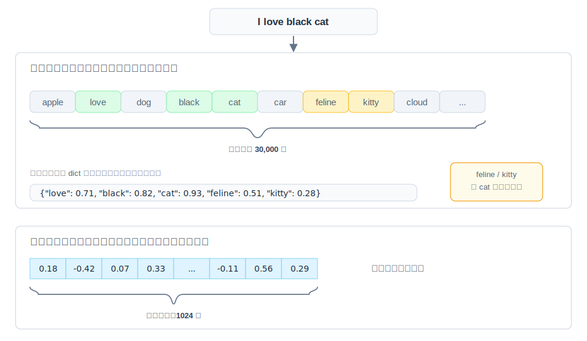
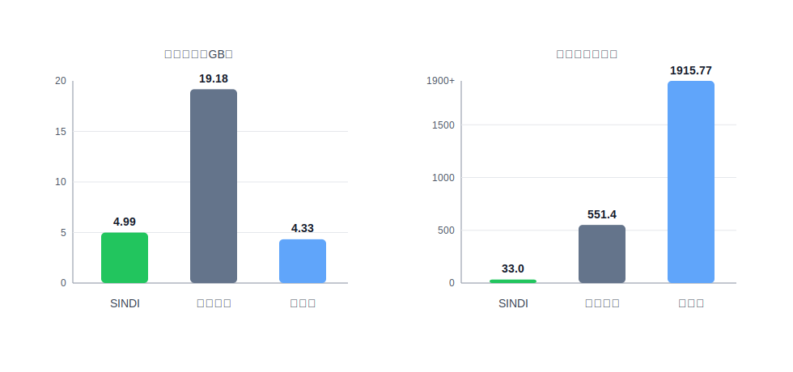
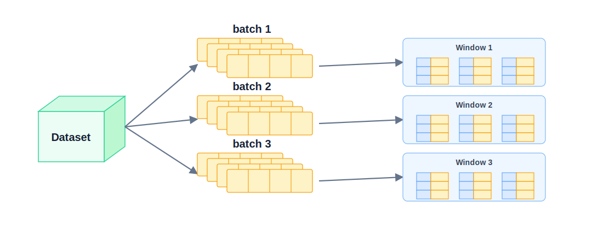
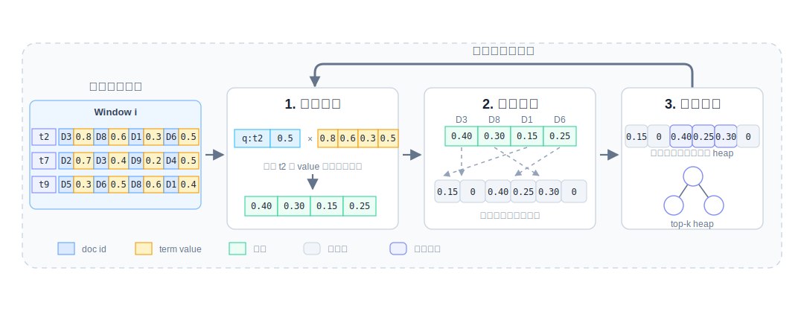
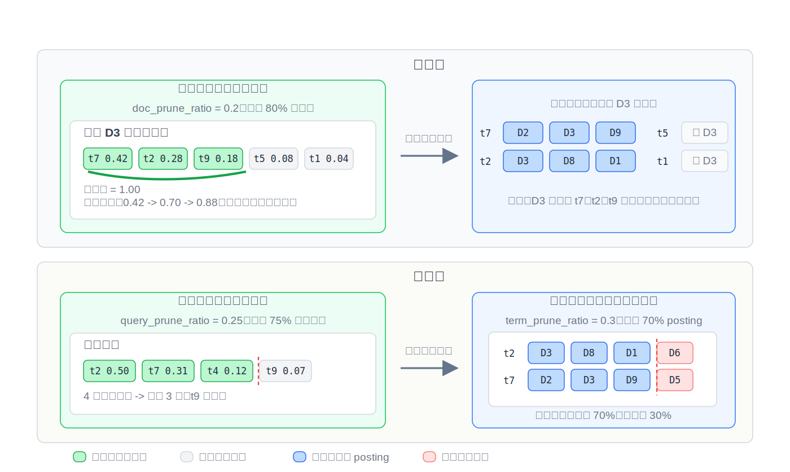
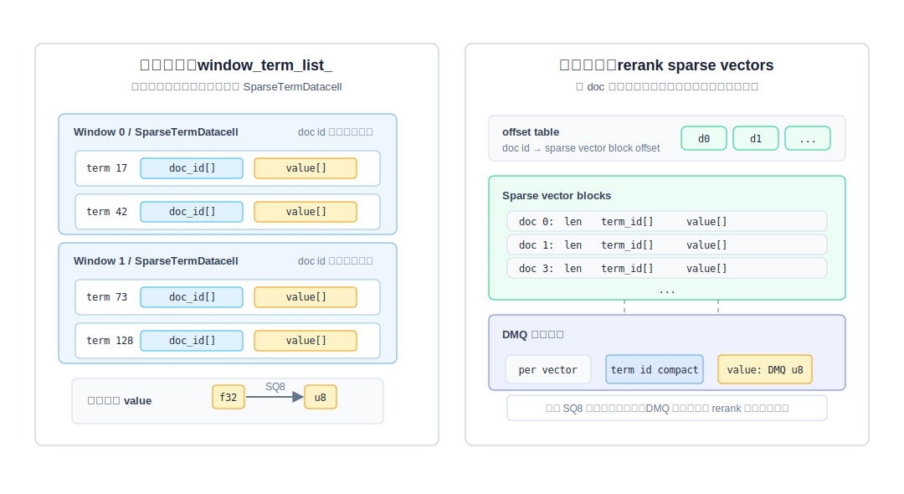

## **稀疏向量检索方案：SINDI 在 VSAG 上的设计与实践（ICDE 2026）**

本文作者：蚂蚁集团 VSAG 团队 李若瑄

# 1、为什么需要 SINDI

## （1）从用户问题说起

在阅读本文之前，读者应该对向量检索、倒排索引等基础概念有一定了解。读完本文后，你将了解：1）稀疏向量检索的核心挑战；2）SINDI 的窗口化倒排、多层剪枝、量化与重排等关键设计；3）如何在 VSAG 中配置和调优 SINDI 索引。

在 **`RAG（Retrieval-Augmented Generation，检索增强生成）`** 、智能搜索和推荐系统里，用户的提问越来越“混合”。有人会直接搜产品型号、错误码或专有名词，有人会描述一个模糊需求，也有人会用同义词、简称、口语表达来提问。在实际检索系统中，召回链路既要听懂意思，又不能放过关键字。只靠一条召回链路，很难把这些情况都覆盖住。

**`稠密向量召回（Dense Retrieval）`** 擅长语义泛化：用户没有使用原文关键词时，模型仍然可以通过语义相似性找回相关内容。但它也有明显短板，例如专有名词、产品型号、错误码、长尾实体、代码符号等细粒度词项，往往需要非常精确的匹配信号。

**`传统词项召回（BM25 / TF-IDF）`** 擅长关键词匹配：BM25（Best Match 25，一种基于概率模型的词项权重算法）和 TF-IDF 会根据词项匹配关系给出稳定、可解释的分数。但它们缺少深层语义理解，对同义改写、上下文语义和隐式意图不够敏感。

所以在工业检索里，更常见的做法是把 **`BM25 + 稀疏向量 + 稠密向量`** 放在一起用。BM25 负责字面匹配；稀疏向量负责可解释的语义化词项匹配；稠密向量负责整体语义泛化。三路信号互补后，召回效果通常会高于任意两路组合。

SINDI 要解决的，就是实现更高性能、更低成本的 **`稀疏向量检索（Sparse Vector Search）`** 。

## （2）什么是稀疏向量

**`稀疏向量（Sparse Vector）`** 是一种只记录高维词表或特征空间中少量非零 **`词项（Term）`** 及其权重的向量表示。

稀疏向量的关键特征可以被概括成以下三点：

1. **高维且极度稀疏**：维度可以达到几万甚至几十万，但每条文档或查询只包含少量非零项。
2. **语义化的词项扩展**：**`学习稀疏模型（Learned Sparse Model）`** 不只统计原文词频，还可以通过模型激活与上下文相关的词项和同义词，让稀疏向量具备一定语义扩展能力。
3. **可解释性强**：每个非零维度都对应明确的词项或特征，权重也可以直接参与排查。线上出现 bad case 时，研发人员能够看到是哪些 term 拉高或拉低了分数。



图 1：稀疏向量和稠密向量的表示差异

>  **例 1**
> 如图 1，同一句 “I love black cat” 可以被表示成两类完全不同的向量。**`稠密向量（Dense Vector）`** 会把整句话压成一段固定长度的浮点数组，例如 `[0.18, -0.42, 0.07, ...]`。这些维度共同表达整体语义，但单独看某一维，通常无法解释它对应哪个词或特征。
>
> **`稀疏向量（Sparse Vector）`** 则建立在一个很大的词表空间上。图 1 中，词表空间可以达到 30,000 维，但真正有权重的位置只有少数几个。原文中的 `love`、`black`、`cat` 会被记录下来，学习稀疏模型还可能进一步激活 `feline`、`kitty` 这类和 `cat` 语义相关的词项。
>
> 存储时，稀疏向量通常不会保存完整的 30,000 维数组，而是只保存非零项及其权重，压缩成 `{love: 0.71, black: 0.82, cat: 0.93, feline: 0.51, kitty: 0.28}`。在工程实现中即保存为一组 **`(term_id, weight)`** 对。这样既保留了可解释的词项信号，也避免了为大量 0 值浪费存储空间。
>
> 因此，二者的核心区别在于：稠密向量每一维通常不可直接解释，但整体语义表达能力强；稀疏向量每一维都对应实际词项，通过激活相关词支持一定的语义能力。

所以，稀疏向量不是“只会做关键词匹配”。它也有一定语义能力，只是表达方式仍然保留在词表空间里。

稀疏向量检索的核心是 **`最大内积搜索（Maximum Inner Product Search，MIPS）`** 。给定查询稀疏向量 $ q $ 和文档稀疏向量 $ d $，只需要计算两边重合词项上的 **`权重乘积和`** ：

$$
score(q,d)=\sum_{t \in q \cap d}q_t \cdot d_t
$$

VSAG 的 SINDI 正是围绕这一计算模式设计的稀疏向量索引。

## （3）SINDI 带来的核心价值

SINDI 由 VSAG 团队与华东师范大学合作研发，发表于 **`ICDE（IEEE International Conference on Data Engineering，数据库领域 CCF-A 类顶级会议）`** 。它适合 **`BM25`** 、**`SPLADE（一种基于 Transformer 的学习稀疏模型）`** 、**`BGE-M3 sparse（BAAI 开源多语言嵌入模型中的稀疏向量版本）`** 等召回链路中的稀疏表示。

和传统倒排索引、图索引相比，SINDI 的第一点优势是 **`低成本索引构建`**。这里的低成本，主要体现在两件事上：构建速度快，索引规模小。在 1000 万规模的中文数据集上，SINDI 的构建时间只有 **33.0 秒**，索引规模为 **4.99 GB**。作为对比，传统倒排方案需要 **551.4 秒**，索引规模达到 **19.18 GB**；开源图索引方案的索引规模接近，但构建时间达到 **1915.77 秒**。



图 2：索引规模和构建时间对比

第二点优势是 **`效率和精度的平衡`** 。在高召回目标下，SINDI 仍然能保持很高吞吐。下表里，Zilliz 是 **`BigANN Benchmark sparse track`** 的 **`SOTA（State of the Art，当前最优）`** 索引，PyANNS 是开源 SOTA 索引。可以看到，当召回要求从 90% 提升到 99% 时，SINDI 的 **`QPS（Queries Per Second，每秒查询数）`** 均为 **最优**，且下降更为平缓。

| 方案 | 召回 90% QPS | 召回 95% QPS | 召回 99% QPS |
| --- | ---: | ---: | ---: |
| SINDI | 14236 | 11839 | 3920 |
| Zilliz | 13815 | 8046 | <2000 |
| PyANNS | 12427 | 6025 | <2000 |

第三点优势是 **`参数更容易分析`** 。SINDI 提供了静态和动态两类索引分析能力，可以指导开发者分析索引内存利用率、词表和数据预处理是否匹配、倒排链是否存在明显长尾，以及 **`剪枝（Pruning）`** 、**`量化（Quantization）`** 、**`候选池（Candidate Pool）`** 和 **`重排（Reranking）`** 分别对召回与耗时产生了多大影响。这样在调整候选数量、查询剪枝、词项剪枝、文档剪枝、量化和重排参数时，索引更易调优，可以在使用成本和效果之间取得更好的平衡。

[//]: # (参数更容易分析换一种说法：索引可调优，使用成本 vs. 效果)

在设计 SINDI 时，团队也对比过纯图索引方案和纯倒排方案。图索引在极高召回场景下有较强表达能力，但构建成本和参数复杂度较高；纯倒排方案构建快、结构简单，但查询吞吐容易受长倒排链和随机访问影响。SINDI 最终选择窗口化带权倒排结构，是在构建成本、查询性能、内存占用和召回率之间的综合权衡。

下面继续看 SINDI 是怎么做到这些效果的。

# 2、SINDI 的关键设计

## （1）Window-based 带权倒排结构



图 3：SINDI 的窗口化倒排结构

稀疏向量检索的瓶颈除了乘法和加法计算本身，还有内存访问。

传统倒排表和图索引如果只保存 **`doc id（文档编号）`** ，计算分数时还需要回到原始向量区域查找 **`term 权重`** 。这个过程会带来大量 **`随机访问（Random Access）`** ，**`CPU Cache 命中率`** 就会下降。CPU Cache 是处理器高速缓存，命中率越高说明数据读取越高效；一旦频繁缓存未命中，吞吐就很容易被内存延迟限制住。

SINDI 采用的是 **`带权倒排列表（Value-based Inverted List）`** ：每个 **`term list（词项倒排链）`** 不只保存文档编号，同时保留该 term 在文档里的权重。查询访问某个 term 时，可以沿着一段连续数组顺序读出 **`局部文档编号 + 文档侧权重`** ，直接计算 **`查询侧权重 × 文档侧权重`** ，再累加到距离数组里。这样查询时按数组顺序扫描，减少回查原始向量带来的随机跳转。

SINDI 还引入了 **`Window-based（窗口化）`** 组织方式。这里的窗口可以理解为一批连续编号的文档，每个窗口大小相同。构建时，全量文档会被切成多个窗口，每个窗口维护一组独立的 term list。窗口分片限制了单次处理的文档范围，距离数组只需要覆盖当前窗口。相比维护一张面向全量文档的巨大分数表，窗口内的距离数组更容易留在缓存里，更新得分时也能减少随机访问带来的 **`缓存未命中（Cache Miss）`** 。同时，窗口内 doc id 以 `uint16_t`（无符号 16 位整数类型，可表示 0 到 65535 的范围）保存，因此 `window_size` 被限制在 10,000 到 60,000 之间，还可以降低 doc id 的存储占用。

简单说，SINDI 希望把查询尽量变成“顺序读、就地算、少跳转”。这也是它在大规模稀疏向量检索中保持高吞吐的关键。

## （2）Term-based 高效得分机制



图 4：SINDI 的按词项得分计算流程

SINDI 查询阶段采用 **`Term-based（按词项驱动）`** 的得分方式。给定一个查询，系统会先拿到查询里有权重的词项。然后在每个窗口里，逐个访问这些词项对应的倒排列表。

每次访问倒排列表时，SINDI 会把 **`查询侧权重 × 文档侧权重`** 的结果累加到当前 window 的 **`距离表（Distance Table）`** 中。等当前窗口里所有查询词项都扫完后，距离表里的分数就是每个候选文档和查询的完整内积分数。接下来，SINDI 再把分数较高的文档更新到 **top-k 候选堆** 里。

这个做法的好处是很明显的。它不是把每篇文档都拿出来和查询完整比较，而是让查询词项主动去倒排列表里找可能相关的文档。对于不相关的词项和文档，SINDI 直接跳过。这极大地减少了查找共同词项的开销，因为大部分文档和查询只会在少数词项上有交集。

配合前面的 window-based 布局，SINDI 每次只维护当前窗口内的一张临时距离表。扫描倒排列表、累加分数、更新候选，都尽量在小范围内完成。这样内存访问更连续，距离表也更容易被缓存住。简单说，就是少看无关文档，少做随机访问，把计算集中在真正可能命中的文档上。

>  **例 2**
> 如图 4，SINDI 的搜索过程可以理解成嵌套循环：**外层遍历所有 window，内层遍历查询里的 term**。系统先进入 `Window i`，为这个窗口准备一张只覆盖窗口内文档的距离表；然后逐个处理查询词项。当前窗口处理完成后，SINDI 会用该窗口里的高分文档更新全局 top-k 候选堆，再进入下一个 window，重复同样的过程。
>
> 以 `Window i` 为例，假设当前查询包含词项 `t2`，且查询侧权重为 `0.5`。SINDI 会在当前 window 中找到 `t2` 对应的 term list。这个列表里包含若干个 posting ，例如 `(D3, 0.8)`、`(D8, 0.6)`、`(D1, 0.3)`、 `(D6, 0.5)`。这里每个 posting 都表示“某篇文档包含 `t2`，且文档侧权重是多少”。
>
> 计算时，SINDI 不会把文档完整向量取出来比较，而是直接用查询侧权重乘以 posting 中的文档侧权重：
>
> $$D3: 0.5 \times 0.8 = 0.40$$
>
> $$D8: 0.5 \times 0.6 = 0.30$$
>
> $$D1: 0.5 \times 0.3 = 0.15$$
>
> $$D6: 0.5 \times 0.5 = 0.25$$
>
> 这些结果会被累加到 `Window i` 的距离表里。比如 `D3` 在 `t2` 上先得到 `0.40`，如果后续又命中 `t7` 或 `t9`，新的乘积会继续加到 `D3` 的同一个距离表位置上。等当前窗口里的所有查询词项都处理完，距离表中的值就是该窗口内每篇候选文档的近似内积分数。最后，SINDI 用这个窗口里的高分文档更新全局 top-k 候选堆，并清空或复用距离表，继续处理下一个窗口。

在 VSAG 开源库的接口设计中，最终返回的是距离值。为了和 **`距离越小越相似`** 的统一语义对齐，SINDI 会把内积分数转换成距离：

$ distance = 1 - inner\_product $

内积越大，距离越小，排序方向就和其他索引保持一致。

## （3）多层剪枝策略



图 5：SINDI 的三类剪枝策略

稀疏向量检索的计算量，主要看两个因素：查询里有多少词项，以及这些词项对应的倒排列表有多长。SINDI 围绕这两个因素做了三层剪枝：构建期的文档侧剪枝、搜索期的查询侧剪枝，以及倒排列表侧剪枝。

第一层是 **`文档侧剪枝（Document Pruning）`** ，它发生在构建索引时。SINDI 会先看每篇文档自己的稀疏向量，按权重累计的质量比例做剪枝，优先保留权重更高的词项，丢掉一部分贡献较小的词项。被剪掉的词项不会写入倒排索引，因此可以直接缩短倒排列表并降低索引规模。

这种剪枝更适合权重有长尾分布的稀疏向量。也就是少数高权重词项贡献了主要内积分数，大量低权重尾端词项贡献很小。剪掉这些尾端词项，可以明显缩短倒排列表，降低计算量和索引规模，同时对内积精度影响相对有限。

第二层是 **`查询侧剪枝（Query Pruning）`** 。它发生在搜索时。一次查询里也会有很多词项，但不是每个词项都同样重要。SINDI 可以只保留查询里权重更高的词项。被剪掉的查询词项，本次搜索就不再访问它的倒排列表。这样访问的列表更少，延迟也会下降。对延迟敏感的在线服务，这一层很实用。

第三层是 **`倒排列表侧剪枝（Term-list Pruning）`** 。即使某个查询词项被保留下来，它对应的倒排列表也可能很长。比如一个高频词项，可能命中大量文档。如果每次都扫完整列表，成本还是会很高。SINDI 可以只扫描列表前面更有价值的一部分，跳过后面一部分 **`posting（倒排项）`** 。这样可以继续压低单个词项带来的计算量。

>  **例 3**
> 如图 5，上半部分展示的是构建期的 **`文档侧剪枝`**。文档 `D3` 原本有 5 个词项：`t7:0.42`、`t2:0.28`、`t9:0.18`、`t5:0.08`、`t1:0.04`，总质量为 `1.00`。当 `doc_prune_ratio = 0.2` 时，可以理解为保留约 `80%` 的主要质量。SINDI 按权重从高到低累计：
>
> $$t7: 0.42$$
>
> $$t7 + t2: 0.42 + 0.28 = 0.70$$
>
> $$t7 + t2 + t9: 0.42 + 0.28 + 0.18 = 0.88$$
>
> 累计到 `0.88` 后已经覆盖主要质量，因此 `t7`、`t2`、`t9` 会被写入倒排索引，`t5`、`t1` 会被丢弃。右侧倒排索引里能看到 `D3` 出现在 `t7`、`t2` 等保留词项列表中，而不会出现在 `t5`、`t1` 这些低贡献词项里。
>
> 下半部分展示的是搜索期的两类剪枝。首先是 **`查询侧剪枝`**：查询向量里有 `t2:0.50`、`t7:0.31`、`t4:0.12`、`t9:0.07`。当 `query_prune_ratio = 25%` 时，4 个查询词项中保留权重最高的 3 个，所以 `t2`、`t7`、`t4` 被保留，低权重的 `t9` 本次搜索不再访问。
>
> 然后是 **`倒排列表侧剪枝`**：对于仍然被访问的 `t2` 和 `t7`，如果 `term_prune_ratio = 30%`，则每条倒排列表只扫描前 `70%` posting。图中 `t2` 列表会扫描 `D3`、`D8`、`D1`，跳过后面的 `D6`；`t7` 列表会扫描 `D2`、`D3`、`D9`，跳过后面的 `D5`。三层剪枝叠加后，SINDI 同时减少了写入索引的词项、查询访问的列表数量和单条列表的扫描长度。

[//]: # (25%=》0.25)

这三层剪枝可以组合使用。实际调参时，一般不会一上来就剪很多。更常见的做法是先轻剪，通过 **`analyze（索引分析）`** 功能输出观察 **`recall（召回率）`** 、QPS 和索引规模的变化，然后逐步加大剪枝强度。

## （4）量化与重排：精度与内存的平衡

剪枝可以提升效率，也能降低索引规模。但它毕竟丢掉了一部分信息，所以会带来一定精度损失。为了把精度拉回来，SINDI 支持 **`重排（Reranking）`** 。它会先用倒排索引快速召回一批候选，再用原始稀疏向量重新计算分数，让最终 top-k 更接近精确结果。



图 6：SINDI 的倒排索引和正排数据组织

也就是说，SINDI 的索引包含两部分： **`倒排索引`** 和精排用的 **`正排数据（Forward Data）`** 。图 6 展示了 SINDI 在 VSAG 中的索引结构和布局：左侧是 **`倒排索引 window_term_list_`** 。它先按 window 切分，每个 window 对应一个 **`SparseTermDatacell`** 。在一个 datacell 里，每个 term 都有两条列表-- `doc_id[]` 和 `value[]`。这里的 `doc_id` 是窗口内编号，不是全局文档编号，所以可以用更小的数据类型保存；`value` 是该 term 在对应文档里的权重。

右侧是重排用的 **`正排数据 rerank sparse vectors`** 。它按 doc 组织，每篇文档对应一个 sparse vector block，block 里保存这篇文档的 `len`、`term_id[]` 和 `value[]`。上面的 **`offset table`** 记录的是 doc id 到向量 block 位置的映射。这样粗排拿到候选 doc 后，就能通过 offset 直接找到这篇文档的完整稀疏向量，再重新计算内积分数。

这里会引出一个新的问题：重排需要额外保存一份原始数据。当数据规模变大时，这两部分都需要量化压缩。

第一部分是 **`倒排索引压缩`** 。前面提到过，SINDI 通过 window 组织倒排列表，可以把局部 doc id 从 `uint32` 压到 `uint16`。除此之外，SINDI 还可以用 **`SQ8（Scalar Quantization 8-bit，8 位标量量化）`** 把倒排索引里的 value 压缩到 8-bit。查询粗排时直接用量化后的 value 参与打分，不需要先解码成 float；并且，**倒排量化结合重排后对最终精度基本无损**。

从实验数据看，倒排量化让倒排索引内存占用减半。在英文 880 万规模数据集上，优化前内存为 **9.26 GB**，量化后为 **4.25 GB**，降低 **54.10%**。在中文 1000 万规模数据集上，优化前内存为 **6.82 GB**，量化后为 **3.19 GB**，降低 **53.23%**。

| 数据集 | 数据集规模 | 优化前内存 | 量化后内存 | 降低比例 |
| --- | ---: | ---: | ---: | ---: |
| 英文数据集 | 8.42 GB | 9.26 GB | 4.25 GB | 54.10% |
| 中文数据集 | 3.06 GB | 6.82 GB | 3.19 GB | 53.23% |

第二部分是 **`正排数据压缩`** 。SINDI 可以用 **`DMQ（Distribution Maintenance Quantization，分布维持量化）`** 压缩精排用的原始稀疏向量副本：term id 按实际词表范围做 **`bit packing（位打包）`** ，value 用 **`8-bit DMQ code`** 保存。解码时再结合每个 term 的 **`码本（Codebook）`** ，以及每篇文档自己的均值和缩放因子，还原出近似 value 参与精排。

在 1000 万规模数据集上，DMQ 可以把精排原始数据压缩约 **50%**，召回只下降约 **1%**。同时，QPS（Queries Per Second，用于评估查询吞吐性能）下降不到 **10%**。也就是说，它用较小的召回和吞吐损失，换来了明显的内存下降。

# 3、VSAG 中使用 SINDI

## （1）启用参数示例

下面是一个 SINDI 构建参数示例：

```cpp
std::string sindi_build_parameters = R"({
    "dtype": "sparse",
    "metric_type": "ip",
    "dim": 128,
    "index_param": {
        "term_id_limit": 1000000,
        "window_size": 60000,
        "doc_prune_ratio": 0.0,
        "use_quantization": false,
        "use_reorder": true,
        "remap_term_ids": false
    }
})";

auto index = vsag::Factory::CreateIndex("sindi", sindi_build_parameters).value();
```

上述代码构建后，预期会返回一个支持最大内积搜索的稀疏向量索引对象。

搜索时，参数放在 `sindi` 子对象下：

```cpp
std::string sindi_search_parameters = R"({
    "sindi": {
        "n_candidate": 200,
        "query_prune_ratio": 0.0,
        "term_prune_ratio": 0.0,
        "use_term_lists_heap_insert": true
    }
})";

auto result = index->KnnSearch(query, 10, sindi_search_parameters).value();
```

上述代码会返回当前查询的 top-k 近邻结果。

## （2）核心参数说明

|  | **参数名** | **位置** | **范围/默认值** | **含义** | **推荐用法** |
| --- | --- | --- | --- | --- | --- |
| **必填** | `dtype` | 顶层 | `"sparse"` | 声明输入数据为稀疏向量。 | 使用 SINDI 时固定为 `"sparse"`。 |
|  | `metric_type` | 顶层 | `"ip"` | 使用最大内积搜索；`ip` 表示 Inner Product，SINDI 会返回 `1 - inner_product` 作为距离。 | 使用 SINDI 时固定为 `"ip"`。 |
|  | `dim` | 顶层 | 正整数 | 单条稀疏向量允许的最大非零项数量，**不是词表大小**。 | 按模型输出的最大非零项数设置；例如每条向量最多保留 128 个词项，则设为 128。 |
| **可选（构建）** | `term_id_limit` | `index_param` | `(0, 50000000]`，默认 `1000000` | 词项 ID 上界，应不小于最大 term id + 1；未开启 **`term id 重映射`** 时会影响倒排结构的可寻址范围。 | 按词表大小或最大 term id + 1 设置；term id 很稀疏时优先考虑开启 `remap_term_ids`。 |
|  | `window_size` | `index_param` | `[10000, 60000]`，默认 `50000` | 每个窗口容纳的文档数；窗口内 doc id 使用 `uint16_t` 保存，并影响距离表的缓存友好性。 | 通常使用默认值；更关注吞吐时可在 50000 到 60000 间尝试。 |
|  | `doc_prune_ratio` | `index_param` | `[0.0, 0.9]`，默认 `0.0` | 构建期文档侧剪枝比例，按权重丢弃每篇文档中贡献较小的词项。 | 高召回基线设为 `0.0`；需要压缩索引或提速时从 `0.1`、`0.2` 逐步调高，并配合 analyze 观察召回损失。 |
|  | `use_quantization` | `index_param` | `true` 或 `false`，默认 `false` | 是否对倒排索引里的 value 开启 **`8-bit 标量量化（SQ8）`** ，用于降低倒排索引内存。 | 内存敏感场景建议开启；极致精度基线可先关闭。 |
|  | `use_reorder` | `index_param` | `true` 或 `false`，默认 `false` | 是否额外保留高精度原始稀疏向量，用于对粗筛候选做 **`精排`** 。 | 追求召回时建议开启；内存极敏感且可接受召回损失时关闭。 |
|  | `remap_term_ids` | `index_param` | `true` 或 `false`，默认 `false` | 是否在建索引前重映射 term id，减少稀疏或有大量空洞词表带来的内存浪费。 | 外部词表 ID、哈希 ID 或 term id 分布很稀疏时开启；连续紧凑词表可关闭。 |
|  | `avg_doc_term_length` | `index_param` | 正整数，默认 `100` | 每篇文档平均非零词项数，仅用于内存估算，不改变索引构建和检索结果。 | 做 `EstimateMemory` 时按数据集统计值填写；普通构建可以不设置。 |
| **可选（搜索）** | `n_candidate` | `sindi` | `[0, 500 * topk]`，默认 `0` | **`粗筛候选堆`** 大小；为 `0` 时实际候选规模至少为 `topk`，显式设置时不能超过 `500 * topk`。 | 开启重排时通常设为 `10 * topk` 到 `50 * topk` 起步；召回不足时调大，延迟过高时调小。 |
|  | `query_prune_ratio` | `sindi` | `[0.0, 0.9]`，默认 `0.0` | 查询侧剪枝比例，搜索时丢弃查询向量中低权重的词项。 | 延迟敏感场景从 `0.1` 或 `0.2` 试起；高召回场景保持 `0.0`。 |
|  | `term_prune_ratio` | `sindi` | `[0.0, 0.9]`，默认 `0.0` | 倒排列表侧剪枝比例，搜索时跳过列表中低权重的 posting。 | 存在超长倒排列表或高频 term 时尝试调高；如果召回下降明显，应降低该值或增大 `n_candidate`。 |
|  | `use_term_lists_heap_insert` | `sindi` | `true` 或 `false`，默认 `true` | 是否按访问过的 term list 顺序插入候选堆，通常能减少无效堆操作。 | 一般保持默认 `true`；只有在做性能对比或排查时再切换验证。 |

# 4、总结

SINDI 是 VSAG 为稀疏向量检索设计的 **`高性能倒排索引`** 。它利用稀疏向量 **`只在少量词项上非零`** 的特点，把最大内积搜索转换成对相关倒排列表的顺序扫描和得分叠加。再通过 **`窗口化数据布局`** 、**`带权倒排列表`** 、**`多层剪枝`** 、**`8-bit 量化`** 和 **`高精度重排`** ，形成一套兼顾成本、性能和召回的工程方案。

在 RAG 和搜索系统中，SINDI 可以很好地承担 **`稀疏向量召回`** 这一层。它比 **`纯词法检索（Lexical Retrieval）`** 更有语义扩展能力，又比稠密向量更容易解释和排查。对于已使用 VSAG 稠密索引的开发者，SINDI 也是一个自然的补充方向，可以让 **`混合召回链路`** 更加完整。

SINDI 更适合以下场景：1）需要语义扩展能力的稀疏向量召回；2）内存、构建成本和查询吞吐都比较敏感的大规模检索；3）需要通过 term 匹配排查 bad case 的调试场景。它不适合替代纯稠密向量检索；如果任务只需要稠密语义召回，可以优先使用 VSAG 的 HNSW 等稠密索引。对于超小规模数据，倒排索引的结构优势也不一定明显。

需要注意的是，SINDI 目前不支持硬删除，对于过滤场景的支持也比较有限。此外，窗口大小、候选数量、剪枝比例和量化配置都和数据分布相关，需要通过 analyze 输出和召回评测逐步调参。

# 5、参考

## （1）数据集地址：

[1] sparse-1M数据集：https://storage.googleapis.com/ann-challenge-sparse-vectors/csr/base_1M.csr.gz

[2] sparse-full数据集：https://storage.googleapis.com/ann-challenge-sparse-vectors/csr/base_full.csr.gz


## （2）参考文献：

[1] SINDI 论文：https://arxiv.org/abs/2509.08395

[2] SINDI 博客：https://mp.weixin.qq.com/s/A5pu7YBtApECJz4uAWMhBQ


## （3）参考代码：

[1] VSAG：https://github.com/antgroup/vsag
