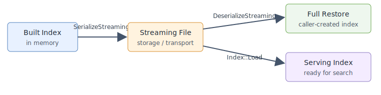
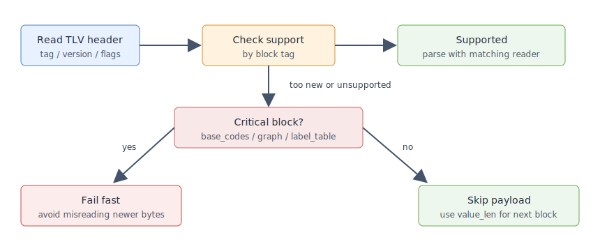

# New Serialization

The new serialization format is designed for large index artifacts and forward-only readers. Its
main goals are:

- Make the file self-describing from the beginning, so readers can inspect the magic, version,
  metadata, and block manifest without seeking to a footer.
- Split index content into typed TLV blocks, so tools can inspect block sizes and future readers can
  skip unknown non-critical blocks.
- Provide one streaming path for full restoration (`DeserializeStreaming`) and policy-based loading
  (`Load`).
- Support debugging and operations tooling through a stable layout that can be visualized.

The new serialization format is **not compatible** with the previous `Serialize`/`Deserialize`
format. Files written by `SerializeStreaming` must be read with `DeserializeStreaming` or `Load`;
files written by `Serialize` must be read with `Deserialize`.

## Usage Model

Serialization and deserialization are the persistence and transport path for index artifacts.
`SerializeStreaming` writes a built index into a self-describing file, and `DeserializeStreaming`
restores the complete in-memory index when a caller already knows which index object to create.
`Index::Load` is the serving path: it creates the index from the file metadata and returns an
`IndexPtr` that can be used for search.



## Streaming Serialization

`SerializeStreaming`, `DeserializeStreaming`, and `Load` write and read a forward-only index file.
The format is designed for large index artifacts where the reader should not seek to a footer
before it can understand the file layout. It is currently implemented for BruteForce, HGraph, IVF,
SINDI, and Pyramid.

```cpp
auto index = vsag::Factory::CreateIndex("hgraph", build_params).value();
index->Build(base).value();

{
    std::ofstream out("hgraph.streaming", std::ios::binary);
    index->SerializeStreaming(out).value();
}

auto restored = vsag::Factory::CreateIndex("hgraph", build_params).value();
{
    std::ifstream in("hgraph.streaming", std::ios::binary);
    restored->DeserializeStreaming(in).value();
}

vsag::IndexPtr loaded;
{
    std::ifstream in("hgraph.streaming", std::ios::binary);
    loaded = vsag::Index::Load(in, "{}").value();
}
```

## Static Load

`Index::Load` is the entry point for policy-based loading from the new streaming format. Unlike
`DeserializeStreaming`, callers do not create an empty index first. `Load` reads the streaming
metadata, checks the serialized index type and `basic_info["index_param"]`, creates the matching
index internally, and then loads the TLV body blocks according to the load parameters.

```cpp
std::ifstream in("hgraph.streaming", std::ios::binary);
vsag::LoadParameters load_parameters(R"({"base_io_type":"block_memory_io"})");
auto loaded = vsag::Index::Load(in, load_parameters).value();
```

The returned value is a ready-to-use `IndexPtr`, so this is the preferred path for loading
an index that will serve search traffic. Load parameters control placement policy for supported
blocks. The parameters object can be built from a JSON string and can also carry reader objects
with `SetReader`. Unsupported policies return an error instead of silently falling back. The API
currently supports streaming BruteForce, HGraph, IVF, SINDI, and Pyramid indexes. BruteForce
supports limited block placement policies. HGraph can bind `high_precision_codes` to an external
reader through `precise_reader`. IVF, SINDI, and Pyramid currently load all emitted streaming
blocks into memory.

## File Layout

A streaming file starts with a fixed header and then a sequence of TLV blocks:

```text
magic("vsagstm0")
format_version
metadata_length
metadata_json
metadata_checksum
block_header + block_payload
block_header + block_payload
...
section_end
```

The metadata JSON stores the index name, basic index information, and a block manifest; build
parameters are stored in `basic_info["index_param"]`. The manifest lists the expected block tags,
block versions, and whether a block is critical. Unknown critical blocks fail deserialization;
unknown non-critical blocks can be skipped by compatible readers.

## TLV Block Version Compatibility

`format_version` describes the whole streaming file structure, such as the fixed header, metadata
layout, and TLV framing. When only one block payload changes in a binary-incompatible
way, the format should not bump the global format version. Instead, bump the
`block_version` of that TLV block. For
example, if HGraph `base_codes` cannot be parsed by older readers after a `basic_flatten_codes`
implementation change, the `base_codes` block version must be increased.

Each independently evolving block must distinguish two kinds of version information:

- **Current write version**: the `block_version` written by the current code when serializing that
  block.
- **Supported read versions**: the set or range of block versions that the current code can read for
  that block.

After a reader reads the TLV header, it checks whether `tag + block_version` is supported by the
current code:

- Supported versions are parsed by the matching block reader.
- Unsupported critical blocks fail fast, preventing older code from misreading newer bytes.
- Unsupported non-critical blocks are skipped with `value_len`, then reading continues from the next
  block.

Therefore, when a block is upgraded from v1 to v2, the implementation must not only change the
current write version to v2; it must also update that block's supported read versions. If the new
code keeps the v1 reader, supported versions should include both v1 and v2 so v2 code can still load
v1 indexes. If v1 is intentionally no longer supported, remove it from the supported versions and
make old critical blocks fail explicitly.

The block manifest in metadata lets tools and readers inspect expected block versions before reading
the body. During body parsing, the `block_version` stored in each TLV header remains the
authoritative version for that payload.



## BruteForce Blocks

BruteForce writes these streaming blocks in order:

| Block | Contents | Required |
| --- | --- | --- |
| `attribute_filter` | optional attribute filter index | conditional |
| `base_codes` | flatten codes used for exhaustive search | yes |
| `label_table` | external labels and label remap | yes |

`DeserializeStreaming` restores the full in-memory BruteForce index. `Load` currently requires
`base_codes` to be loaded into memory; reader-based loading for required BruteForce codes is
rejected.

## HGraph Blocks

HGraph writes these streaming blocks in order:

| Block | Contents | Required |
| --- | --- | --- |
| `label_table` | external labels, label remap, optional source id table | yes |
| `base_codes` | base flatten codes used by graph search | yes |
| `bottom_graph` | bottom-layer graph over all vectors | yes |
| `high_precision_codes` | precise reorder codes when reorder uses separate codes | conditional |
| `route_graphs` | all upper route graph layers | yes |
| `extra_info` | optional extra info payloads | conditional |
| `attribute_filter` | optional attribute filter index | conditional |
| `raw_vector` | optional stored raw vectors | conditional |

`DeserializeStreaming` restores the full in-memory index. `Load` loads HGraph blocks into memory by
default. Load parameters can set `precise_io_type` to override the IO type for `precise_codes`. If
they also provide `precise_reader`, and that reader size matches the `high_precision_codes` payload
size, `Load` validates the external reader payload checksum and then binds reorder codes to that
reader.

## IVF Blocks

IVF writes these streaming blocks in order:

| Block | Contents | Required |
| --- | --- | --- |
| `ivf_bucket` | bucket datacell payloads for inverted lists | yes |
| `ivf_partition_strategy` | partition strategy state, such as trained centroids | yes |
| `label_table` | external labels and label remap | yes |
| `high_precision_codes` | reorder codes when IVF reorder is enabled | conditional |
| `attribute_filter` | optional attribute filter index | conditional |

`DeserializeStreaming` restores the full in-memory IVF index. `Index::Load` can create the IVF
index directly from streaming metadata and currently loads all emitted IVF blocks into memory.

## SINDI Blocks

SINDI writes these streaming blocks in order:

| Block | Contents | Required |
| --- | --- | --- |
| `sindi_windows` | sparse term windows and quantization runtime state | yes |
| `label_table` | external labels and label remap | yes |
| `sindi_rerank_index` | optional rerank flat index when rerank is enabled | conditional |
| `sindi_term_id_mapper` | optional term-id remapping table | conditional |

`DeserializeStreaming` restores the full in-memory SINDI index. `Index::Load` can create the SINDI
index directly from streaming metadata and currently loads all emitted SINDI blocks into memory.
Immutable SINDI runtime serialization is not supported by this streaming path.

## Pyramid Blocks

Pyramid writes these streaming blocks in order:

| Block | Contents | Required |
| --- | --- | --- |
| `label_table` | external labels and label remap | yes |
| `base_codes` | base flatten codes used by graph search | yes |
| `high_precision_codes` | precise reorder codes when reorder is enabled | conditional |
| `pyramid_hierarchies` | hierarchy names and graph roots | yes |

`DeserializeStreaming` restores the full in-memory Pyramid index. `Index::Load` can create the
Pyramid index directly from streaming metadata and currently loads all emitted Pyramid blocks into
memory.

## Visualizing a Streaming Index

Build the tool and point it at a streaming index file:

```bash
cmake --build build --target visualize_index
build/tools/visualize_index/visualize_index \
  --index_path /tmp/vsag-hgraph-streaming.index \
  --html /tmp/vsag-hgraph-streaming.html
```

The CLI output includes a raw horizontal layout by real byte proportion and a compact logical-block
layout. The HTML output groups related small segments, such as a TLV header and its payload, and
shows exact segment details in tables.

See `examples/cpp/403_persistent_streaming_load.cpp` for runnable examples of streaming
serialization and `Index::Load`.
