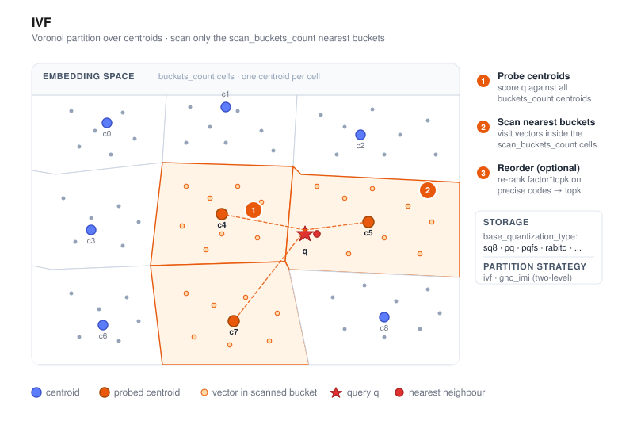

# IVF



IVF (Inverted File) is VSAG's **partition-based** index. It clusters the corpus into
buckets at build time, and at query time only scans the buckets whose centroids are
closest to the query. This turns an O(N) linear scan into O(N · `scan_buckets_count`
/ `buckets_count`) with tunable recall/latency.

IVF trades a little recall (compared to graph indexes) for lower memory overhead,
higher throughput on batch workloads, and simpler sharding — which makes it a good
default when the corpus is large (hundreds of millions or more), when memory is
tight, or when queries are naturally parallelizable.

- Source: `src/algorithm/ivf.{h,cpp}`, `src/algorithm/ivf_parameter.{h,cpp}`
- Example: [`examples/cpp/106_index_ivf.cpp`](https://github.com/antgroup/vsag/blob/main/examples/cpp/106_index_ivf.cpp)

## How it works

1. **Clustering.** A sample of the dataset is clustered with k-means (or sampled
   randomly, `ivf_train_type: "random"`) to produce `buckets_count` centroids.
2. **Assignment.** Every vector is written to the inverted list of its nearest
   centroid, stored in the configured coarse quantization (`base_quantization_type`).
   Optionally, a second high-precision copy is kept (`use_reorder: true`) for
   post-filter reordering.
3. **Search.** For each query, the `scan_buckets_count` nearest centroids are
   computed first, then the vectors in those buckets are scored. When reordering is
   enabled, `factor` controls how many extra candidates are fetched from the coarse
   stage before being re-scored with the precise quantizer.

A second partition strategy, **GNO-IMI** (`partition_strategy_type: "gno_imi"`),
splits the space into two orthogonal sets of centroids
(`first_order_buckets_count` × `second_order_buckets_count`) for even finer
partitioning on very large corpora.

## Quick start

```cpp
#include <vsag/vsag.h>

std::string params = R"({
    "dtype": "float32",
    "metric_type": "l2",
    "dim": 128,
    "index_param": {
        "buckets_count": 256,
        "base_quantization_type": "sq8",
        "partition_strategy_type": "ivf",
        "ivf_train_type": "kmeans"
    }
})";
auto index = vsag::Factory::CreateIndex("ivf", params).value();

// Build.
auto base = vsag::Dataset::Make();
base->NumElements(n)->Dim(128)->Ids(ids)->Float32Vectors(data)->Owner(false);
index->Build(base);

// Search.
auto query = vsag::Dataset::Make();
query->NumElements(1)->Dim(128)->Float32Vectors(q)->Owner(false);
auto result = index->KnnSearch(
    query, /*topk=*/10,
    R"({"ivf": {"scan_buckets_count": 16}})").value();
```

## Input data type

The public `Build`, `Add`, and search paths currently accept FP32 vectors supplied with `Dataset::Float32Vectors`; set `dtype` to `"float32"`. `base_quantization_type` selects internal encoding and storage and does not enable FP16/BF16 input. `dtype: "int8"` is not supported when creating an IVF index.

## Build parameters

Build-time parameters live under `index_param`. See
[Index Parameters](../resources/index_parameters.md) for the exhaustive list.

| Parameter | Type | Default | Description |
|-----------|------|---------|-------------|
| `partition_strategy_type` | string | `"ivf"` | `ivf` (single-level) or `gno_imi` (two-level orthogonal) |
| `buckets_count` | int | `10` | Number of inverted lists (effective for `ivf`) |
| `first_order_buckets_count` | int | `10` | First-level count (effective for `gno_imi`) |
| `second_order_buckets_count` | int | `10` | Second-level count (effective for `gno_imi`) |
| `ivf_train_type` | string | `"kmeans"` | Centroid training: `kmeans` or `random` |
| `route_max_degree` | int | `64` | Routing HGraph maximum degree (effective for `ivf`) |
| `route_ef_construction` | int | `300` | Routing HGraph construction search breadth (effective for `ivf`) |
| `enable_gpu_build` | bool | `false` | Use the CUDA backend while building (effective for `ivf`); see [GPU-accelerated build](#gpu-accelerated-build) |
| `gpu_device_id` | int | `0` | CUDA device ordinal (effective for `ivf`); an ordinal the machine does not have keeps the build on the CPU |
| `gpu_memory_budget` | int | `0` | Ceiling in bytes on the device working set (effective for `ivf`); `0` derives it from what the device has free |
| `gpu_min_work_threshold` | int | `0` | Smallest `count * buckets_count * dim` worth offloading (effective for `ivf`); `0` uses the calibrated default |
| `base_quantization_type` | string | `"fp32"` | `fp32`, `fp16`, `bf16`, `sq8`, `sq4`, `sq8_uniform`, `sq4_uniform`, `pq`, `pqfs`, `rabitq` — see the [Quantization chapter](../quantization/) for per-quantizer details |
| `base_pq_dim` | int | `1` | PQ subspaces (required with `pq` / `pqfs`) |
| `rabitq_pca_dim` | int | `0` | Optional PCA preprocessing dimension for `base_quantization_type: "rabitq"` |
| `rabitq_bits_per_dim_query` | int | `32` | Query bits for `rabitq`; allowed values are `4` or `32` |
| `rabitq_bits_per_dim_base` | int | `1` | Stored-code bits for `rabitq`; allowed range is `[1, 8]` |
| `rabitq_bits_per_dim_precise` | int | unset | Enables RaBitQ split storage and sets the supplement (`y`) bits; `rabitq_bits_per_dim_base` is the filter (`x`) bits and `x + y <= 8` |
| `rabitq_version` | string | `"standard"` | `rabitq` layout: `"standard"` or `"split_1bit_7bit"` |
| `rabitq_error_rate` | float | `1.9` | Positive error-budget parameter for `rabitq` encoding |
| `rabitq_use_fht` | bool | `false` | Enable FHT rotation before `rabitq` binarization |
| `fast_encode_rabitq` | bool | `true` | Use CAQ fast construction for multi-bit `rabitq`; set to `false` for exact encoding |
| `fast_encode_rabitq_rounds` | int | `6` | CAQ adjustment rounds; allowed range is `[1, 32]` |
| `use_residual` | bool | `false` | Encode vectors relative to their IVF bucket centroid (`x-c`). |
| `use_reorder` | bool | `false` | Keep a high-precision copy and re-rank after the coarse scan |
| `precise_quantization_type` | string | `"fp32"` | Quantizer used for reordering (with `use_reorder: true`) |
| `precise_codes_layout` | string | `"flat"` | Storage layout for precise codes: `"flat"` keeps the legacy one-code-per-vector layout; `"bucket"` stores the precise code in the same bucket and offset as its basic posting |
| `base_io_type` | string | `"memory_io"` | Storage backend for coarse codes; supports `uring_io` when built with liburing |
| `base_supplement_io_type` | string | unset | Optional IO backend for RaBitQ split supplement codes |
| `base_supplement_file_path` | string | derived | Optional file path for disk-backed RaBitQ supplement codes |
| `precise_io_type` | string | `"block_memory_io"` | Storage backend for precise codes (`memory_io`, `block_memory_io`, `mmap_io`, `buffer_io`, `async_io`, `uring_io`, `reader_io`) |
| `precise_file_path` | string | `""` | File path when the precise IO type is disk-backed |

`precise_codes_layout: "bucket"` requires `use_reorder: true`. It supports
`memory_io`, `block_memory_io`, `buffer_io`, `async_io`, and `uring_io`
(when io_uring is available).
`mmap_io` and `pqfs` precise quantization are not supported. The bucket layout currently requires
`buckets_per_data: 1`; configurations that assign one vector to multiple buckets are rejected.

For both `flat` and `bucket` layouts, serialized precise codes can be loaded read-only from an
external `Reader`. Pass `precise_io_type: "reader_io"` and `precise_reader` to `Index::Load`.
The reader must expose exactly the `high_precision_codes` block payload for `flat`, or the
`ivf_precise_bucket` block payload for `bucket`. `reader_io` uses the normal read cache when
`precise_enable_read_cache` is enabled.

```cpp
vsag::LoadParameters load_parameters;
load_parameters.Set("precise_io_type", "reader_io")
    .Set("precise_enable_read_cache", true)
    .Set("precise_cache_total_size", 256ULL * 1024 * 1024)
    .SetReader("precise_reader", precise_codes_reader);
auto loaded = vsag::Index::Load(stream, load_parameters).value();
```

`reader_io` is a load-and-query placement policy. Build the index with a writable precise IO,
serialize it, and then use the external reader when loading it for search.

A rule of thumb for `buckets_count` is `sqrt(N)` to `4 * sqrt(N)` where `N` is the
corpus size.

### GPU-accelerated build

Building an IVF index is dominated by two things: clustering the training sample
into centroids, and then assigning every base vector to its bucket. Clustering
grows with `buckets_count`, because the sample does too (`train_sample_count`
defaults to `max(65536, 64 * buckets_count)`), and with
`ivf_train_type: "kmeans"` the seeding pass alone is
`O(buckets_count * train_sample_count * dim)` and runs single-threaded.

When VSAG is built with `ENABLE_CUDA=ON`, both move to a CUDA device. Set
`enable_gpu_build` to turn it on:

```json
{
    "buckets_count": 4096,
    "base_quantization_type": "fp32",
    "partition_strategy_type": "ivf",
    "ivf_train_type": "kmeans",
    "enable_gpu_build": true,
    "gpu_device_id": 0
}
```

Four passes run on the device: k-means++ seeding, nearest-centroid assignment
and centroid accumulation inside clustering, and the bucket assignment of the
base vectors afterwards. `ivf_train_type: "random"` does not cluster, so only
the last one applies to it.

The four settings reach the `ivf` partition strategy only. With
`partition_strategy_type: "gno_imi"` they are accepted and ignored, as the other
strategy-specific parameters in the table are, and that build stays on the host.

**Scope.** Only the build changes. Search is untouched: queries still route through the
graph, which is the right shape for one query at a time. The four settings are
recorded in the index footer as every other build parameter is, so two otherwise
identical builds are not byte-identical, but the compatibility check on load
ignores them: an index built with the backend on loads into a reader configured
any other way, including one on a machine with no GPU, and then behaves as that
reader is configured. The centroids can differ slightly from a host build's: the
random choices come from the caller's generator either way, but the device sums
each cluster with atomics in no fixed order.

**Fallback.** A pass that declines is taken by the host, silently, and returns
what a build with the backend off would have returned. This happens when VSAG
was built without CUDA, no device is present, `gpu_device_id` names an ordinal
the machine does not have, the problem is below `gpu_min_work_threshold`, the
budget cannot hold what a pass needs, or any CUDA call fails. A build never
fails because of the backend.

Two cases stay on the host by design. Inner-product metrics order buckets by the
dot product alone, which is not what the device pass minimises, so they keep the
graph routing. A build that asked for a reproducible reduction keeps centroid
accumulation on the host as well, since the device sums with atomics whose
order is not fixed.

**Memory.** Vectors are streamed in chunks, so the corpus does not have to fit
in device memory; only the centroids and one chunk do. The working set is
bounded by `gpu_memory_budget`, by default derived from what the device reports
free, so the same build behaves on a small card and makes use of a large one.
Seeding differs only in shape: it sweeps the whole training sample once per
centroid, so the sample has to be resident rather than chunked, and a sample the
budget cannot hold sends seeding back to the host while the other passes stay on
it. When no budget is named the chunked passes take a default ceiling, since a
chunk larger than what saturates the device only costs more; seeding takes what
the device has free, because a ceiling there would only push large samples to
the host.

Measured on SIFT1M (1M base vectors, 128 dimensions), against a 48-thread host
build as the baseline:

| `buckets_count` | CPU build | GPU build | Speedup | Recall@10 change |
|-----------------|-----------|-----------|---------|------------------|
| 1000 | 59.45 s | 6.30 s | 9.43x | +0.058 pt |
| 4096 | 167.66 s | 8.02 s | 20.90x | +0.075 pt |
| 16384 | 729.04 s | 27.21 s | 26.79x | +0.079 pt |

The speedup grows with `buckets_count` because clustering takes a larger share
of the build. How large it is depends on the balance between the host's CPU and
its GPU, which is also what `gpu_min_work_threshold` exists to retune.

Recall moves because the device compares against every centroid where the host
does not, in two places.

Assigning base vectors to buckets, on the default `use_route_graph: true`
layout, searches the routing graph, which is approximate. On 20000 random
vectors of 64 dimensions the two paths agreed exactly at `buckets_count` 16; at
256 and 1000 they placed roughly 10% and 12% of the vectors in different
buckets, the device naming the nearer centroid in every one of those cases, and
the mean distance to the assigned centroid improved by under 1% and by about 2%.
The figures shift a little from run to run, because training is not seeded and
each run clusters differently; they held across unit-norm and raw random data.
The scan layout assigns exactly on either path and does not move.

Clustering does the same above 10000 centroids, where the host switches to a
graph search over the centroids to keep training affordable.

So a build with the backend on assigns somewhat better, not only faster. The
evidence for that is the distance comparison above, not the recall column: the
table is one run per configuration, and recall between two separately trained
indexes moves by more than the differences it shows. Four builds with identical
settings on 50000 random vectors of 128 dimensions spanned a full point of
recall, against the hundredths of a point in the table. Read that column as
showing no regression, not as measuring the gain. Below those sizes the two agree
except where two centroids are equidistant from a point to within floating-point
rounding.

## RaBitQ split storage

Set both quantizers to `rabitq` and divide the stored precision into filter
(`x`) and supplement (`y`) bits:

```json
{
    "base_quantization_type": "rabitq",
    "precise_quantization_type": "rabitq",
    "rabitq_bits_per_dim_query": 32,
    "rabitq_bits_per_dim_base": 3,
    "rabitq_bits_per_dim_precise": 5,
    "use_reorder": true
}
```

IVF stores the `x`-bit filter planes in bucket-local 32-vector packed blocks and
stores the `y`-bit supplement separately. The default `candidate_reorder`
strategy scans only the packed x bits, retains `factor * topk` candidates, and
carries the byte-LUT-quantized x-bit inner product together with each
candidate's source bucket, offset, and version. Normal reranking combines this
saved inner product with the y-bit supplement contribution. It does not reread
or unpack x-bit planes and does not reconstruct the inner product from a
distance hint.

For residual L2 candidate search, all routed buckets share one LUT built from
the original transformed query. Per-lane factors recover the raw filter-code
contribution and combine it with the supplement under the original query, so
normal reranking does not build a `q-c` computer. A correctness fallback may
unpack x bits only when the saved value or factors are invalid, source
provenance is stale, or a FastScan lane could not produce a valid result.

The split configuration requires `x >= 1`, `y >= 1`, `x + y <= 8`,
`rabitq_bits_per_dim_query: 32`, `use_reorder: true`, and
`buckets_per_data: 1`. Bucket-local graphs (`graph_build_threshold > 0`) are
not supported with split storage. Supported homogeneous IO backends are
`memory_io`, `block_memory_io`, `buffer_io`, `async_io`, `mmap_io`,
and `reader_io`; the supported hybrid layout is filter
`block_memory_io` plus supplement `async_io`.

## Search parameters

Search-time parameters live under the `ivf` sub-object:

| Parameter | Type | Default | Description |
|-----------|------|---------|-------------|
| `scan_buckets_count` | int | — (required) | Number of buckets probed per query. Must be ≤ `buckets_count` (except when `disable_bucket_scan` is true, where larger values are allowed and unavailable slots are padded with `-1`). |
| `disable_bucket_scan` | bool | `false` | Return bucket IDs and distances. Supports batch queries. |
| `factor` | float | `2.0` | With reordering enabled, pulls `factor * topk` coarse candidates before the precise rescore. |
| `enable_reorder` | bool | `true` | Set to `false` to skip the final reorder stage for this request even when the index was built with reorder enabled. |
| `parallelism` | int | `1` | Threads used to scan buckets in parallel for a single query. |
| `timeout_ms` | double | `+∞` | Hard cap in milliseconds; partial results are returned once exceeded. |

```cpp
auto result = index->KnnSearch(
    query, topk,
    R"({"ivf": {"scan_buckets_count": 32, "factor": 2.0, "parallelism": 4}})").value();
```

```cpp
auto fast_result = index->KnnSearch(
    query, topk,
    R"({"ivf": {"scan_buckets_count": 32, "factor": 2.0, "enable_reorder": false}})").value();
```

## When to use IVF

- Large corpora (hundreds of millions of vectors and above), especially when the
  working set does not fit comfortably in RAM.
- Batch or high-throughput workloads where per-query latency is less critical than
  queries-per-second.
- Memory-tight deployments that benefit from aggressive quantization (`sq8`,
  `sq4_uniform`, `pq`, `pqfs`) combined with `use_reorder` to recover recall.
- Shard-friendly setups: buckets map naturally onto shards or disk blocks.

For latency-sensitive, high-recall workloads on dense embeddings, compare against
[HGraph](hgraph.md) first.

## See also

- [Creating an Index](../guide/create_index.md)
- [Index Parameters](../resources/index_parameters.md)
- [Serialization](../advanced/serialization.md)
