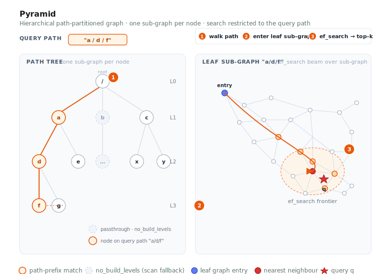

# Pyramid



Pyramid is VSAG's **hierarchical, path-partitioned** graph index. Every vector is
tagged with a path string such as `"a/d/f"`, and Pyramid builds a graph per node
in that path tree. At query time you supply a path prefix, and Pyramid restricts
the search to the corresponding sub-tree.

This is ideal for multi-tenant deployments, tag-partitioned catalogs, or any
scenario where one logical index serves many groups that must not cross-contaminate
results.

- Source: `src/algorithm/pyramid.{h,cpp}`, `src/algorithm/pyramid_zparameters.{h,cpp}`
- Example (single hierarchy): [`examples/cpp/107_index_pyramid.cpp`](https://github.com/antgroup/vsag/blob/main/examples/cpp/107_index_pyramid.cpp)
- Example (multi-hierarchy): [`examples/cpp/112_index_pyramid_multi_hierarchy.cpp`](https://github.com/antgroup/vsag/blob/main/examples/cpp/112_index_pyramid_multi_hierarchy.cpp)

## How it works

1. **Path tree.** Each vector carries a `path` in addition to its id. Paths use
   `/` as separator (e.g. `"tenant_a/lang_en/topic_news"`). Pyramid builds one
   sub-index for every path prefix seen during build.
2. **Per-level sub-graphs.** By default every level gets its own proximity graph.
   Use `no_build_levels` to skip levels that are too small or too coarse to
   benefit from graph indexing — those levels still exist as passthrough
   containers, but search degrades to a scan.
3. **Graph construction.** Each sub-graph is built with the same machinery as
   HGraph: `nsw` insertion or `odescent` with `graph_iter_turn`,
   `neighbor_sample_rate`, and `alpha` for pruning. Base vectors are stored in
   `base_quantization_type`; optional reordering keeps a high-precision copy.
4. **Search.** Query vectors also carry a path. The search walks down the tree
   to the most specific sub-graph matching the query path and runs a graph search
   there with `ef_search` (and `subindex_ef_search` for intermediate levels).

## Quick start

```cpp
#include <vsag/vsag.h>

std::string params = R"({
    "dtype": "float32",
    "metric_type": "l2",
    "dim": 128,
    "index_param": {
        "base_quantization_type": "sq8",
        "max_degree": 32,
        "alpha": 1.2,
        "graph_type": "odescent",
        "graph_iter_turn": 15,
        "neighbor_sample_rate": 0.2,
        "no_build_levels": [0, 1],
        "use_reorder": true,
        "build_thread_count": 16
    }
})";
auto index = vsag::Factory::CreateIndex("pyramid", params).value();

// Build with per-vector paths.
auto base = vsag::Dataset::Make();
base->NumElements(n)
    ->Dim(128)
    ->Ids(ids)
    ->Paths(paths)          // std::string* of length n, e.g. "a/d/f"
    ->Float32Vectors(data)
    ->Owner(false);
index->Build(base);

// Search restricted to a path prefix.
std::string query_path = "a/d";
auto query = vsag::Dataset::Make();
query->NumElements(1)
    ->Dim(128)
    ->Float32Vectors(q)
    ->Paths(&query_path)
    ->Owner(false);
auto result = index->KnnSearch(
    query, /*topk=*/10,
    R"({"pyramid": {"ef_search": 100}})").value();
```

## Build parameters

Build-time parameters live under `index_param`.

| Parameter | Type | Default | Description |
|-----------|------|---------|-------------|
| `base_quantization_type` | string | — | Coarse storage quantizer (`fp32`, `fp16`, `bf16`, `sq8`, `sq4`, `sq8_uniform`, `sq4_uniform`, `pq`, `pqfs`, `rabitq`). See the [Quantization chapter](../quantization/README.md) for per-quantizer details. |
| `max_degree` | int | `64` | Maximum out-degree per node within a sub-graph. |
| `graph_type` | string | `"nsw"` | `nsw` or `odescent`. |
| `ef_construction` | int | `400` | Candidate list size for `nsw` builds. |
| `alpha` | float | `1.2` | Pruning factor during graph construction. |
| `graph_iter_turn` | int | — | ODescent iterations (effective with `graph_type: "odescent"`). |
| `neighbor_sample_rate` | float | — | ODescent neighbor sampling rate. |
| `no_build_levels` | int[] | `[]` | Tree levels that skip graph construction (0-indexed from the root). |
| `use_reorder` | bool | `false` | Keep a high-precision copy for rescoring. |
| `precise_quantization_type` | string | `"fp32"` | Quantizer for reordering. |
| `index_min_size` | int | `0` | Minimum sub-index size; smaller groups fall back to scan. |
| `support_duplicate` | bool | `false` | Allow duplicate ids. |
| `build_thread_count` | int | `1` | Threads used for parallel build. |
| `hierarchies` | array | `[]` | Named hierarchy definitions. Each element is either a string (inherits all top-level params) or an object with `name` and optional overrides (`max_degree`, `ef_construction`, `alpha`, `no_build_levels`, `index_min_size`). When present, multi-hierarchy mode is activated and each hierarchy maintains its own independent path tree. |

## Search parameters

Search-time parameters live under the `pyramid` sub-object:

| Parameter | Type | Default | Description |
|-----------|------|---------|-------------|
| `ef_search` | int | `100` | Candidate list size for the leaf-level graph search. |
| `subindex_ef_search` | int | `50` | Candidate list size used when traversing intermediate sub-graphs on the path. |
| `hierarchies` | string[] | `[]` | Select which hierarchy to search. Empty means use the default (unnamed) hierarchy. |
| `hierarchy_op` | string | `"single"` | How to combine results across hierarchies: `single` (search one hierarchy), `union`, or `intersection`. **Note:** `union` and `intersection` are not yet implemented — setting them will cause `KnnSearch`/`RangeSearch` to return an error. |

```cpp
auto result = index->KnnSearch(
    query, topk,
    R"({"pyramid": {"ef_search": 200, "subindex_ef_search": 80}})").value();
```

## Multi-Hierarchy Support

A single Pyramid index can maintain **multiple independent path trees**, each
identified by a name (e.g. `"site"`, `"category"`). Vectors share IDs and data
across all hierarchies — only the paths differ. Each hierarchy can optionally
override graph construction parameters.

This is useful when the same set of vectors needs to be partitioned along
different dimensions simultaneously. For example, an e-commerce platform might
partition products by **site** (`site-a/lang-en`) and by **category**
(`electronics/phones`) at the same time, and search can target either hierarchy
independently.

### Build configuration

Add a `hierarchies` array inside `index_param`. Each element is either:
- A **string** (inherits all top-level params): `"site"`
- An **object** with `name` and optional per-hierarchy overrides:
  `{"name": "category", "max_degree": 64, "no_build_levels": [0]}`

Overridable per-hierarchy parameters: `max_degree`, `ef_construction`, `alpha`,
`no_build_levels`, `index_min_size`.

```json
{
    "dtype": "float32",
    "metric_type": "l2",
    "dim": 128,
    "index_param": {
        "base_quantization_type": "sq8",
        "max_degree": 32,
        "alpha": 1.2,
        "graph_type": "odescent",
        "graph_iter_turn": 15,
        "neighbor_sample_rate": 0.2,
        "no_build_levels": [0, 1],
        "use_reorder": true,
        "build_thread_count": 16,
        "hierarchies": [
            "site",
            {"name": "category", "max_degree": 64, "no_build_levels": [0]}
        ]
    }
}
```

### Dataset API for named hierarchies

Use the overloaded `Paths(hierarchy_name, paths)` method to assign paths per
hierarchy. The same `Ids()` and `Float32Vectors()` are shared across all
hierarchies:

```cpp
auto base = vsag::Dataset::Make();
base->NumElements(n)
    ->Dim(128)
    ->Ids(ids)
    ->Float32Vectors(data)
    ->Paths("site", site_paths)         // std::string* of length n
    ->Paths("category", category_paths) // independent paths for 2nd hierarchy
    ->Owner(false);
index->Build(base);
```

### Searching a specific hierarchy

Specify which hierarchy to search via `"hierarchies"` in the search parameters.
The query dataset must also set its path on the matching hierarchy name:

```cpp
auto query = vsag::Dataset::Make();
query->NumElements(1)
    ->Dim(128)
    ->Float32Vectors(q)
    ->Paths("site", &query_path)   // target the "site" hierarchy
    ->Owner(false);

auto result = index->KnnSearch(
    query, /*topk=*/10,
    R"({"pyramid": {"ef_search": 100, "hierarchies": ["site"]}})").value();
```

### Incremental insertion (Add)

`Add()` works the same as `Build()` — provide named paths and the index inserts
into all matching hierarchies:

```cpp
auto new_data = vsag::Dataset::Make();
new_data->NumElements(count)
    ->Dim(128)
    ->Ids(new_ids)
    ->Float32Vectors(new_vectors)
    ->Paths("site", new_site_paths)
    ->Paths("category", new_cat_paths);
index->Add(new_data);
```

### RangeSearch

RangeSearch also supports hierarchy selection via the same search parameters:

```cpp
auto result = index->RangeSearch(
    query, /*radius=*/20.0f,
    R"({"pyramid": {"ef_search": 100, "hierarchies": ["category"]}})").value();
```

### Serialize & Deserialize

Multi-hierarchy indexes serialize and deserialize transparently. The serialized
format includes all hierarchy names and their graph structures:

```cpp
// Serialize
auto binary_set = index->Serialize().value();

// Deserialize into a new index (must use the same build params)
auto new_index = vsag::Factory::CreateIndex("pyramid", build_params).value();
new_index->Deserialize(binary_set);
```

## When to use Pyramid

- Multi-tenant services where each tenant must see results only from its own
  partition, and you would otherwise maintain one index per tenant.
- Content catalogs with hierarchical tags (language / region / category) where
  queries always scope to a known prefix.
- Workloads with many small partitions: `no_build_levels` and `index_min_size`
  let you skip graph construction for partitions too small to benefit.

If you don't need path-based scoping, [HGraph](hgraph.md) is simpler and generally
faster.

## Mark remove

Pyramid supports `RemoveMode::MARK_REMOVE`. Calling `Remove(ids)` (the default
mode) tombstones the given ids: they are excluded from subsequent search results,
`GetNumElements()` drops by the number removed, and `GetNumberRemoved()` reports
the running total. Removing an id that is absent or already removed is a no-op.
`RemoveMode::FORCE_REMOVE` is not supported and returns an error.

Mark-removed vectors still occupy memory until the index is rebuilt; the space is
not physically reclaimed.

## See also

- [Creating an Index](../guide/create_index.md)
- [Index Parameters](../resources/index_parameters.md)
- [Graph Enhancement](../advanced/enhance_graph.md)
- [HGraph](hgraph.md)
