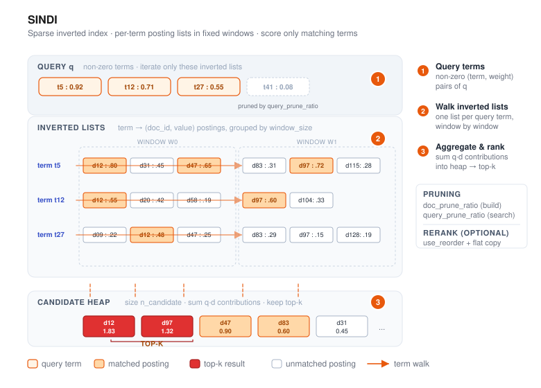

# SINDI



SINDI (**S**parse **IN**verted **D**ense **I**ndex) is VSAG's index for **sparse
vectors** — the kind produced by BM25, SPLADE, and other learned-sparse encoders.
Unlike the dense indexes (HGraph, IVF), SINDI operates directly on term/value
pairs and is one of the VSAG indexes that accepts `dtype: "sparse"`.

- Source: `src/algorithm/sindi/`
- Example: [`examples/cpp/109_index_sindi.cpp`](https://github.com/antgroup/vsag/blob/main/examples/cpp/109_index_sindi.cpp)

## How it works

1. **Window-based inverted lists.** Documents are grouped into fixed-size windows
   (`window_size`). Within each window, an inverted list per term maps a term id
   to the `(doc_id, value)` pairs that mention it.
2. **Optional pruning and quantization.** During construction, `doc_prune_ratio`
   drops low-weight terms per document. `use_quantization: true` stores SQ8 values,
   while `use_quantization: "fp16"` stores half-precision values.
3. **Scoring.** At query time, SINDI iterates the non-zero terms of the query,
   walks the corresponding inverted lists in each window, aggregates contributions
   into a max-heap of size `n_candidate`, and returns the top-k. When `use_reorder`
   is enabled, the candidates are re-scored against a forward store. The default
   forward store keeps fp32 values, while `rerank_type: "dmq8"` uses a compressed
   DMQ store to reduce rerank memory.

Distance is returned as `1 - inner_product` so results sort ascending as in the
dense indexes.

For deployments that need both in-memory and disk-based I/O, use
[SINDI_V2](sindi_v2.md).

## Quick start

```cpp
#include <vsag/vsag.h>

std::string params = R"({
    "dtype": "sparse",
    "metric_type": "ip",
    "dim": 1024,
    "index_param": {
        "term_id_limit": 30000,
        "window_size": 50000,
        "doc_prune_ratio": 0.0,
        "use_quantization": false,
        "use_reorder": false,
        "remap_term_ids": false
    }
})";
auto index = vsag::Factory::CreateIndex("sindi", params).value();

// Build a dataset of SparseVector.
auto base = vsag::Dataset::Make();
base->NumElements(n)
    ->SparseVectors(sparse_vectors)  // vsag::SparseVector*
    ->Ids(ids)
    ->Owner(false);
index->Build(base);

// Search.
auto query = vsag::Dataset::Make();
query->NumElements(1)->SparseVectors(&query_vec)->Owner(false);
auto result = index->KnnSearch(
    query, /*topk=*/10,
    R"({"sindi": {"n_candidate": 100}})").value();
```

## Build parameters

Build-time parameters live under `index_param`. `dtype` **must** be `"sparse"`
and `metric_type` **must** be `"ip"`.

| Parameter | Type | Default | Description |
|-----------|------|---------|-------------|
| `dim` | int | — (required) | Maximum number of non-zero elements per sparse vector. *Not* the vocabulary size. |
| `term_id_limit` | int | `1000000` | Upper bound on term id values (≥ max term id + 1, up to 50 000 000). |
| `window_size` | int | `50000` | Documents per window (range: 10 000 – 60 000). |
| `doc_prune_ratio` | float | `0.0` | Fraction of lowest-weight terms dropped per doc at build time (`[0.0, 1.0)`). |
| `use_quantization` | bool or string | `false` | `false` stores FP32 values, `true` stores SQ8 values, and `"fp16"` stores FP16 values. |
| `use_reorder` | bool | `false` | Keep a forward store and rescore candidates after coarse SINDI scoring. |
| `rerank_type` | string | `"fp32"` | Forward-store type used when `use_reorder` is enabled. `fp32` keeps exact values; `dmq8` stores compressed 8-bit DMQ codes. |
| `dmq_shared_codebook_threshold` | int | `1024` | With `rerank_type: "dmq8"`, terms occurring at most this many times share one codebook; more frequent terms keep independent codebooks. Set to `0` to disable sharing. |
| `remap_term_ids` | bool | `false` | Remap term IDs before indexing; useful when term IDs are sparse or have large gaps. |
| `avg_doc_term_length` | int | `100` | Hint for memory estimation only. |
| `immutable` | bool | `false` | Build or load the compact read-only runtime. `Build()` compacts completed windows as it proceeds to reduce peak memory; incremental `Add()` is rejected. |

> **`dim` vs `term_id_limit`.** For the sparse vector `{0:0.1, 2:0.5, 177:0.8}`,
> `dim` is `3` (three non-zero entries) while `term_id_limit` must be ≥ `178`
> (largest term id + 1). Sizing `term_id_limit` to your vocabulary is the most
> common first-time mistake.

### Sparse value formats

`use_quantization` retains its legacy boolean behavior and also accepts one string value:

| Value | Stored value format | Trade-off |
| --- | --- | --- |
| `false` | FP32 | Highest value precision and largest posting payload |
| `true` | SQ8 | Smallest posting values; quantization range is learned during the initial build |
| `"fp16"` | FP16 | Half the FP32 value bytes without SQ8 range calibration |

Indexes built with `false` or `true` retain the legacy serialization representation. Older VSAG
versions cannot parse a SINDI index that uses the new `"fp16"` value format; upgrade readers
before deploying FP16 artifacts.

### Immutable low-memory build

Set `immutable: true` when the completed SINDI index is read-only:

```json
{
    "dtype": "sparse",
    "metric_type": "ip",
    "dim": 1024,
    "index_param": {
        "term_id_limit": 30000,
        "window_size": 50000,
        "use_quantization": "fp16",
        "remap_term_ids": true,
        "immutable": true
    }
}
```

During `Build()`, each completed mutable window is compacted into an immutable payload and the
temporary window is released before construction continues. In the Sparse4M FP16 measurement
reported with this feature, peak build memory fell from 27.03 GB to 6.08 GB (77.51% lower), while
build time increased from about 330 seconds to 599 seconds. Treat these figures as workload-specific
evidence, not a capacity guarantee.

The immutable runtime supports KNN and range search plus legacy `Serialize`/`Deserialize`.
It rejects incremental `Add`, `GetSparseVectorByInnerId`, `CalcDistanceById`, and
`CalDistanceById`. Mutable and immutable runtimes both support `SerializeStreaming`,
`DeserializeStreaming`, and `Index::Load`.
The serialized index must be loaded into a SINDI created with the same `immutable` setting.
New indexes record the sorted posting-list format version and skip normalization when loaded.
Indexes written without this marker remain compatible and are normalized during loading.

### Host filtering

Mutable and immutable SINDI and [SINDI_V2](sindi_v2.md) indexes can group documents by their source
host and avoid returning documents from other hosts. Attach a complete string `host` array to a
host-aware `Build()` or mutable `Add()` batch. Use an empty string for a document with no host:

```cpp
base->NumElements(n)
    ->SparseVectors(sparse_vectors)
    ->Ids(ids)
    ->StringMetadata("host", base_hosts)
    ->Owner(false);
index->Build(base);

std::string query_host = "example.com";
query->NumElements(1)
    ->SparseVectors(&query_vec)
    ->StringMetadata("host", &query_host)
    ->Owner(false);
```

Each `Build()` or mutable `Add()` batch groups internal IDs by host while preserving external
labels. Host queries scan the relevant posting windows and apply exact membership checks over the
host's one or more internal-ID ranges. Repeated mutable `Add()` calls may append disjoint ranges for
the same host. Tombstones and an additional user `Filter` are applied together with host membership.

Host strings are matched byte for byte without case folding or URL normalization. VSAG assigns
compact internal IDs and persists the string-to-ID dictionary with the index; callers never provide
those IDs. The empty string is the missing-host bucket. Once a mutable index contains host metadata,
every later `Add()` must provide a complete `host` array; host metadata cannot be introduced after
host-unaware documents. An empty-string query searches only missing-host documents, while omitting
`host` preserves full-index KNN behavior. An unknown host returns an empty result. Indexes built
without base host metadata ignore query host metadata and retain their previous behavior. The old
numeric `host_id` input is rejected. Host filtering currently applies only to KNN; range search keeps
its existing full-index behavior.

### Date-bucket filtering

Mutable and immutable SINDI can filter KNN queries by hierarchical calendar buckets, with or
without reranking. Attach one canonical string bucket to each base document:

```cpp
std::string base_dates[] = {"", "2026/05", "2026/05/01"};
base->Paths("date", base_dates);

std::string query_date = "2026/05";
query->Paths("date", &query_date)->Owner(false);

std::string date_begin = "2025/11/20";
std::string date_end = "2026/02";
query->Paths("date_begin", &date_begin)
    ->Paths("date_end", &date_end)
    ->Owner(false);
```

Accepted forms are `YYYY`, `YYYY/MM`, and `YYYY/MM/DD`, with valid calendar values and zero-padded
months and days. Matching proceeds down the hierarchy: `2026` matches base buckets at year, month,
or day granularity in 2026; `2026/05` matches `2026/05` and every day below it; `2026/05/01`
matches only that exact day. A more precise query never matches a coarser base bucket.

An empty base string means that the document has no date. Missing-date documents remain searchable
when the query omits all date selectors, including host-only queries, but never match a `date` or
date-range query. Every base document still needs one array entry, so use an empty string instead of
omitting a row. Empty query date strings remain invalid; omit the selector to disable date filtering.

For an inclusive range query, provide `date_begin` and `date_end` together. A year or month at the
beginning expands to its first day, while a year or month at the end expands to its last day. For
example, `2025/11/20` through `2026/02` means `2025/11/20` through `2026/02/28`, inclusive. A base
bucket matches when its complete calendar period is contained in the query range. Consequently, a
range ending at `2026/08/01` can match a base day bucket on August 1, but not the coarser
`2026/08` bucket. The two range endpoints are required together, must be ordered after expansion,
and cannot be combined with the single `date` selector.

The date-aware build places missing dates in a dedicated partition, orders dated documents by
calendar quarter and, when `host` is present, by host inside each partition. For a mutable index,
date metadata can be supplied by `Build()` or the first `Add()` while the index is empty. Once the
index contains documents, date metadata cannot be introduced, and a date-aware mutable index
rejects every later `Add()`. This build-once restriction
avoids incrementally maintaining the quarter partitions. Mutable host-only indexes retain their
existing incremental `Add()` support.

Year-only base buckets are anchored in the first quarter of that year and stored only once. The
physical fixed-size window layout is unchanged. A date query first selects the relevant quarter
partitions, then applies exact hierarchical bucket or range matching before candidates enter the
heap. Query strings are parsed once during routing; candidate checks use only the packed integer
buckets. Date, host, tombstone, and user `Filter` conditions use AND semantics.

Queries without `date`, `date_begin`, or `date_end` search every quarter. Host-only queries select
that host from every quarter. All selected windows share one candidate heap and, when
`use_reorder` is enabled, one rerank pass. Date filtering supports mutable and immutable indexes
with either `use_reorder` setting, applies only to KNN search, and is preserved by both legacy and
streaming serialization. A deserialized mutable date-aware index remains build-once and rejects
`Add()`. Exact bucket and range filtering disable term-level posting pruning in each selected
window, so date queries may scan more postings than host-only queries. Wider ranges also select
more windows. A host-only query on a date-enabled index can require a full scan for windows that
cross quarter or host boundaries.

## Search parameters

Search-time parameters live under the `sindi` sub-object:

| Parameter | Type | Default | Description |
|-----------|------|---------|-------------|
| `n_candidate` | int | `0` | Candidate heap size. When `0`, defaults to `SPARSE_AMPLIFICATION_FACTOR · topk` (500×). If set, must satisfy `1 ≤ n_candidate ≤ SPARSE_AMPLIFICATION_FACTOR · topk`. |
| `filter_callback_limit` | uint64 | `0` | Maximum user `Filter::CheckValid` callback invocations for one filtered search request. A value of `0` disables the limit. Internal checks such as the deleted-ID filter do not count. Reaching a positive limit stops candidate and window scanning after processing the final callback result and returns the already filtered candidates, so the result may be partial. The limit applies to KNN and range search through both the regular APIs and `SearchWithRequest`. |
| `query_prune_ratio` | float | `0.0` | Fraction of lowest-weight query terms skipped (`[0.0, 1.0)`). |
| `term_prune_ratio` | float | `0.0` | Fraction of the lowest-value postings skipped from each term list (`[0.0, 1.0)`). |
| `term_retain_threshold` | uint64 | `0` | Maximum postings for one term across all windows. A value of `0` disables this limit; positive values allow each non-empty window posting list to scan at most `max(1, floor(threshold / window_count))` postings. |

After combining the ratio and threshold limits, SINDI scans at least one posting from every
non-empty term list.

Within each window, postings for a term are sorted by their stored value in descending
order, then by internal document id in ascending order. If both term-prune limits are
enabled, the scanned prefix is the smaller of
`floor(list_size · (1 - ratio))` and `floor(threshold / window_count)`.
SINDI chooses the heap-insertion strategy automatically from the build-time
`doc_prune_ratio` and search-time `query_prune_ratio`. With the current `0.1`
threshold, SINDI uses the distance-array insertion path when both ratios are
`<= 0.1`; if either ratio is greater than `0.1`, it uses term-list heap
insertion. The legacy
`use_term_lists_heap_insert` search parameter is ignored; configure pruning
ratios instead.

```cpp
auto result = index->KnnSearch(
    query, topk,
    R"({"sindi": {"n_candidate": 200, "filter_callback_limit": 10000, "query_prune_ratio": 0.1}})").value();
```

## When to use SINDI

- Sparse retrieval with BM25, SPLADE, uniCOIL, or similar learned-sparse encoders.
- Hybrid dense+sparse pipelines where SINDI handles the sparse leg in parallel with
  HGraph / IVF for dense embeddings.
- Memory-constrained deployments of sparse corpora (`use_quantization: true` selects SQ8,
  while `"fp16"` halves FP32 value bytes; `use_reorder:
  true` trades forward-store memory for recall, and `rerank_type: "dmq8"` reduces
  that forward-store overhead).
- Read-only snapshots that need lower peak build memory (`immutable: true`), accepting slower
  construction and no incremental writes.

SINDI does **not** accept dense vectors and supports only inner-product similarity.
Range search and id-based filtering are supported; see the example for usage.
When `rerank_type` is `dmq8`, codebooks are fixed by the initial build, so incremental
`Add` after the model is established and `UpdateVector` are not supported.

## Practical guidance

- For Chinese corpora, we recommend encoding sparse vectors with BGE-M3. For
    English corpora, SPLADE is the more common default.
- BGE-M3 can emit both sparse and dense vectors. Today SINDI handles the sparse
    leg, and VSAG plans to support fused sparse+dense scoring in a future release.
- Sparse vectors are not a complete replacement for BM25 full-text retrieval. In
    practice, three-way recall with BM25 + sparse + dense usually outperforms any
    two-way combination.
- At the index level, SINDI can also serve BM25-style scoring: use inverse
    document frequency as the query-side term weight, and use term-frequency-based
    weights as the document-side term value.

## Common configurations

1. Flat brute-force sparse index. Keep all non-zero terms in the inverted index
     (`doc_prune_ratio: 0.0`), disable the flat reranker (`use_reorder: false`),
     and disable quantization (`use_quantization: false`). This is the simplest
     high-recall baseline.
2. Pruned high-accuracy index. Prune most low-weight terms during build
     (`doc_prune_ratio: 0.4`), keep the flat copy for reranking
     (`use_reorder: true`), and enable quantization to shrink inverted-list memory
     (`use_quantization: true`). This is a common balance between memory and
     recall.
3. Pruned high-accuracy index with compressed reranking. Use the same pruning and
     inverted-list quantization as above, but set `rerank_type: "dmq8"` together
     with `use_reorder: true` to reduce forward-store memory.
4. Very large sparse vocabularies. When term IDs are sparse within the `uint32`
     range, such as hash-based tokenizers, external vocabulary IDs, or vocabularies
     with large gaps, enable `remap_term_ids: true`. This avoids managing many
     empty posting lists and helps stay below the `term_id_limit` ceiling.
5. Read-only low-memory build. Add `immutable: true`, normally together with
     `use_quantization: "fp16"` and `remap_term_ids: true`, when peak build memory matters more
     than build speed and the finished index will not receive incremental writes.

## Mark remove

SINDI supports `RemoveMode::MARK_REMOVE`. Calling `Remove(ids)` (the default mode)
tombstones the given ids so they no longer appear in search results;
`GetNumElements()` drops accordingly and `GetNumberRemoved()` reports the running
total. Removing an id that is absent or already removed is a no-op.
`RemoveMode::FORCE_REMOVE` is not supported and returns an error.

Mark-removed documents still occupy memory until the index is rebuilt; the space
is not physically reclaimed.

## See also

- [Creating an Index](../guide/create_index.md)
- [Index Parameters](../resources/index_parameters.md)
- [k-Nearest Neighbor Search](../guide/knn_search.md)
