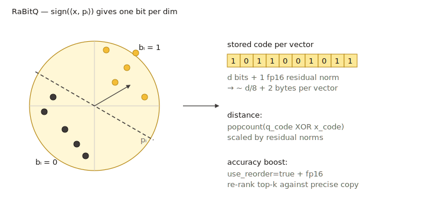

# RaBitQ

`rabitq` is VSAG's binary / low-bit quantizer. In its default mode each
coordinate is encoded with **1 bit**, giving the highest compression ratio
of any built-in quantizer. On HGraph, an `x+y` split mode stores low-bit base
codes as `x` filter bits plus `y` supplement bits, so graph traversal can use
only the filter code and re-ranking can fetch only the supplement bits it needs.



> Implementation: `src/quantization/rabitq_quantization/rabitq_quantizer.cpp`,
> parameter file `rabitq_quantizer_parameter.cpp`.
> For the complete HGraph split layout, lower-bound formula, and IO modes,
> see [RaBitQ x+y Split](rabitq_split.md).

## When to use it

- **Maximum compression.** 1-bit codes are the smallest possible storage
  for dense vectors.
- **High-dim embeddings** where rotation + binarization preserves enough
  geometry for nearest-neighbor search.
- Combined with a precise reorder store (`fp16` / `fp32`) — the standard
  recipe is "RaBitQ + reorder", because the binary distance is noisy on
  its own.

For best accuracy, also enable `rabitq_use_fht: true` or wrap with a
[Transform Quantizer](../advanced/quantization_transform.md) chain such
as `"pca, rom, rabitq"`.

## Memory cost (codes only)

- `rabitq_bits_per_dim_base = 1`: `ceil(dim / 8)` bytes per vector. With
  `dim = 768` that is 96 bytes (vs 3072 for fp32 → 32× smaller).
- `rabitq_bits_per_dim_base = x` plus `rabitq_bits_per_dim_precise = y`
  on HGraph: split mode stores roughly `(x + y) * dim / 8` bytes per vector
  for the RaBitQ code bytes. For example, `3+5` is about `dim` bytes per
  vector.

## Parameters

| Key | Type | Default | Meaning |
| --- | --- | --- | --- |
| `pca_dim` | int | `0` (= input dim) | Optional PCA preprocessing dimension applied inside RaBitQ. `0` means no PCA reduction (`rabitq_quantizer_parameter.cpp:30-32`). |
| `rabitq_bits_per_dim_query` | int | `32` | Bits per dimension used to encode the **query** during search. Allowed values: `4` or `32` (`rabitq_quantizer_parameter.cpp:38-43`). |
| `rabitq_bits_per_dim_base` | int | `1` | In standard RaBitQ, bits per dimension for the stored base code. In HGraph `x+y` split mode, this external key means `x`, the filter bits used during graph traversal. Allowed range `[1, 8]`. |
| `rabitq_bits_per_dim_precise` | int | unset | HGraph-only split-mode key. When present with `base_quantization_type: "rabitq"` and `precise_quantization_type: "rabitq"`, this means `y`, the supplement bits used for reorder/full-distance refinement. The sum `x + y` must be `<= 8`. |
| `rabitq_error_rate` | float | `1.9` | Default lower-bound error multiplier for HGraph split search; must be finite and positive. It can be overridden per search under the `hgraph` object. |
| `use_fht` | bool | `false` | If `true`, applies a Fast Hadamard Transform rotation before binarization. Improves accuracy on anisotropic data with cheap O(dim log dim) cost (`rabitq_quantizer_parameter.cpp:76-78`). |

Index pages expose RaBitQ settings as top-level `index_param` keys:
HGraph exposes `rabitq_pca_dim`, `rabitq_bits_per_dim_query`,
`rabitq_bits_per_dim_base`, `rabitq_bits_per_dim_precise`,
`rabitq_error_rate`, and `rabitq_use_fht`; IVF exposes
`rabitq_pca_dim`, `rabitq_bits_per_dim_query`, `rabitq_bits_per_dim_base`,
`rabitq_version`, `rabitq_error_rate`, and `rabitq_use_fht`; Pyramid exposes
the PCA, base/query bit, and FHT keys for its base quantizer. The
`rabitq_use_fht` key is an index-level alias for the quantizer's internal
`use_fht` key and is rewritten by the index layer.

```json
{
    "dtype": "float32",
    "metric_type": "l2",
    "dim": 768,
    "index_param": {
        "base_quantization_type": "rabitq",
        "rabitq_use_fht": true,
        "rabitq_pca_dim": 0,
        "rabitq_bits_per_dim_base": 1,
        "rabitq_bits_per_dim_query": 32,
        "max_degree": 32,
        "ef_construction": 300,
        "use_reorder": true,
        "precise_quantization_type": "fp32"
    }
}
```

Swap to the higher-accuracy `x+y` split mode by setting both base and precise
quantization to RaBitQ and providing `rabitq_bits_per_dim_precise`. HGraph then
automatically selects the split datacell. In the example below, traversal uses
`x = 3` filter bits and reorder reads only `y = 5` supplement bits:

```json
{
    "base_quantization_type": "rabitq",
    "precise_quantization_type": "rabitq",
    "rabitq_bits_per_dim_base": 3,
    "rabitq_bits_per_dim_precise": 5,
    "rabitq_use_fht": true
}
```

## Training

`NEED_TRAIN` is set. Training learns the rotation and per-dimension
statistics that make the 1-bit encoding well-balanced. The optional FHT
rotation is fixed (not learned), so it adds no extra training cost; PCA
preprocessing (when `pca_dim > 0`) trains a projection matrix.

## Metric compatibility

`l2`, `ip`, `cosine` — all supported. The binary distance kernel is a
popcount over XORed code words; for `ip` / `cosine` the implementation
also tracks a residual norm so the inner-product estimate is unbiased.

## Tips

- **Always enable reorder** unless you have validated that 1-bit recall
  is acceptable on your data. `use_reorder: true` +
  `precise_quantization_type: "fp32"` is the safe default.
- **Rotate first.** For un-normalized data, set `rabitq_use_fht: true` or
  use a `tq` chain that includes `rom` / `fht`.
- **Split mode for accuracy.** HGraph `x+y` split keeps an `x`-bit fast path
  for graph traversal and adds `y` supplement bits for re-ranking; expect
  significantly higher recall than pure 1-bit when using more total bits.

## Related pages

- [Transform Quantizer](../advanced/quantization_transform.md)
- [HGraph index](../indexes/hgraph.md)
- [RaBitQ x+y Split](rabitq_split.md)
- [Quantization overview](README.md)
