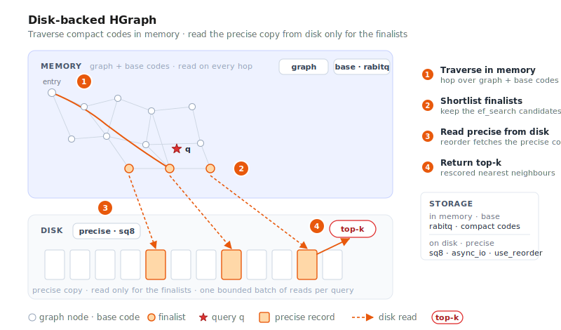

# Disk-Based Index Best Practices



When a corpus grows past the point where every vector fits in RAM, moving the coldest,
largest part of the index onto an SSD is the most direct way to control cost. VSAG does
this by letting each part of an index choose its own storage backend, so hot data stays
in memory while cold data is served from disk. This page covers
**[HGraph](../indexes/hgraph.md) with disk-backed IO** and shows copy-pasteable
configurations, a capacity model, and a tuning checklist.

> "Disk index" here means **tiering the index data across memory and disk**. It is
> unrelated to filtering by scalar attributes alongside the vector — for that, see
> [Attribute Filter (Hybrid Search)](../advanced/attribute_filter.md).

## When to move to disk

A large corpus does not automatically require disk. Weigh these signals first:

| Signal | In-memory is fine | Consider disk |
|--------|-------------------|---------------|
| Corpus size | ≤ tens of millions | Hundreds of millions / billions |
| Full `fp32` fits in RAM | Yes | No |
| Latency budget | Sub-millisecond, strict | A few to low-tens of milliseconds is acceptable |
| Cost structure | RAM cost is acceptable | Want to replace most RAM with SSD |

A quick memory estimate: a full `fp32` copy occupies about `N × dim × 4` bytes. For
example `1e9 × 128 × 4 ≈ 512 GB` and `1e8 × 768 × 4 ≈ 307 GB` — sizes that rarely fit in a
single machine's RAM, which is exactly the disk-index target.

The cost of going to disk is a few random-read I/Os per query, so **latency is higher than
a pure in-memory index**. If your service needs sub-millisecond latency and the data can be
compressed to fit in RAM, prefer in-memory [HGraph](../indexes/hgraph.md) with quantization
instead.

## The core idea

VSAG's disk-backed indexing follows one principle: **keep a small, approximate representation
in memory to navigate, and keep the large, precise representation on disk to rank.** Graph
traversal touches only the in-memory approximate codes; a small number of finalists are then
re-scored ("reordered") against the precise copy read from disk.
Because the disk reads happen only at the end, for only a handful of candidates, the I/O
cost stays bounded while recall is recovered by the precise rescore.

## How HGraph tiers storage

HGraph stores an index as several independent **cells**, and each cell can be pointed at its
own **IO backend**. That is what enables "hot in memory, cold on disk":

| Cell | Holds | Access pattern | Recommended placement |
|------|-------|----------------|-----------------------|
| `graph` | Adjacency lists of the proximity graph | Read on every hop | Memory (or `mmap_io` under pressure) |
| `base` | Quantized codes used to traverse and prune | Read on every hop | Memory |
| `precise` | High-precision copy used to reorder (`use_reorder`) | Read for a few finalists | **Disk** |
| `raw_vector` | Optional raw vectors (`store_raw_vector`) | Rarely, e.g. `cosine`/exact | Memory or disk |

The IO backends you can assign to a cell:

| Backend (`*_io_type`) | Location | Needs `*_file_path` | Notes |
|-----------------------|----------|---------------------|-------|
| `memory_io` | Memory (contiguous) | No | Basic in-memory storage |
| `block_memory_io` | Memory (block-allocated) | No | Default backend for large cells |
| `buffer_io` | Disk (buffered `pread`) | Yes | Portable disk reads; works everywhere |
| `mmap_io` | Disk (mmap + page cache) | Yes | Near-memory speed when the working set fits the page cache |
| `async_io` | Disk (Linux libaio) | Yes | High-concurrency disk reads; **Linux + libaio only**, otherwise falls back to `buffer_io` |
| `reader_io` | Custom `Reader` | No | Read through a user `ReaderSet` at load time (e.g. remote / object storage) |

Each cell is wired with a flat pair of build parameters: `graph_io_type` / `graph_file_path`,
`base_io_type` / `base_file_path`, `precise_io_type` / `precise_file_path`, and
`raw_vector_io_type` / `raw_vector_file_path`. A `*_file_path` is **required** whenever the
matching `*_io_type` is disk-backed (`buffer_io`, `mmap_io`, or `async_io`); the in-memory
backends ignore it. All cells default to `block_memory_io` (fully in memory).

## Recommended configuration: base in memory, precise on disk

The workhorse layout keeps a very compact 3-bit RaBitQ base in memory for traversal and pushes
a higher-precision `sq8` copy to disk for reorder, with `use_reorder` turned on so the
finalists are re-ranked against it:

```json
{
    "dtype": "float32",
    "metric_type": "l2",
    "dim": 128,
    "index_param": {
        "base_quantization_type": "rabitq",
        "rabitq_bits_per_dim_base": 3,
        "max_degree": 32,
        "ef_construction": 400,
        "use_reorder": true,
        "precise_quantization_type": "sq8",
        "precise_io_type": "async_io",
        "precise_file_path": "/data/vsag/hgraph_precise.data"
    }
}
```

Here `rabitq_bits_per_dim_base` selects the standard multi-bit RaBitQ base code (range `[1, 8]`);
leave `rabitq_bits_per_dim_precise` unset so the base stays a plain RaBitQ code rather than
switching to the x+y split variant.

Search is unchanged — set `ef_search` as usual and reorder transparently reads the precise
copy from disk:

```json
{"hgraph": {"ef_search": 200}}
```

The per-query data flow: graph traversal reads only the in-memory `base` codes and `graph`
adjacency; disk I/O happens solely at the end, when reorder fetches the precise copy for
the small candidate set before returning the top-k. This is why a disk-backed HGraph adds
only a bounded number of reads per query rather than one read per hop.

## Hardware and deployment

- **Use NVMe SSDs.** Disk-backed vector search is dominated by random-read latency; NVMe is
  an order of magnitude better than SATA SSDs and essential for `async_io` / `mmap_io`.
- **`async_io` requires Linux with libaio, which is enabled by default.** The CMake option
  `ENABLE_LIBAIO` defaults to `ON`, and the Makefile passes `VSAG_ENABLE_LIBAIO=ON`; you only
  set these flags to turn libaio back on if a previous build disabled it. When libaio is absent
  (including on macOS), `async_io` logs a one-time warning and falls back to `buffer_io`, so
  configs remain portable but lose asynchronous batching. For production throughput, build on
  Linux with libaio.
- **Warm the page cache** for `mmap_io` cells after load (e.g. a sequential read of the file,
  or a warm-up query pass) so early queries do not pay cold-miss latency.
- **Plan file paths and lifecycle.** Disk-backed cells write to the `*_file_path` you supply;
  place them on a fast, dedicated volume with enough space for the precise copy, and clean up
  stale files when rebuilding. Serialize and load the index through the normal
  [Serialization](../advanced/serialization.md) API — the backing files are managed with it.

## Capacity planning

Approximate per-vector storage for the main quantizers (plus small per-vector metadata such
as norms and errors):

| Representation | Bytes per vector | Typical placement |
|----------------|------------------|-------------------|
| `fp32` (precise) | `dim × 4` | Disk |
| `fp16` / `bf16` | `dim × 2` | Memory or disk |
| `sq8` | `dim × 1` | Memory or disk |
| `sq4` | `dim × 0.5` | Memory |
| `rabitq` (b-bit) | `dim × b / 8` | Memory |

Worked example for `N = 1e9`, `dim = 128`:

- 3-bit `rabitq` base in memory: `1e9 × 128 × 3 / 8 ≈ 48 GB` RAM.
- `sq8` precise on disk: `1e9 × 128 × 1 ≈ 128 GB` SSD.
- A full `fp32` precise instead (maximum reorder accuracy): `1e9 × 128 × 4 ≈ 512 GB` SSD.
- Add the graph: roughly `N × max_degree × 4` bytes for neighbor ids (memory or `mmap_io`).

This is how a billion-scale index that would need ~0.5 TB of RAM as pure `fp32` collapses to
tens of GB of RAM plus an SSD.

## Tuning and troubleshooting

| Symptom | Likely cause | Action |
|---------|--------------|--------|
| Recall too low | Base quantization too coarse, or reorder off | Keep `use_reorder: true`; raise `precise_quantization_type` toward `fp32`; increase `ef_search` |
| Latency too high | Too many disk reads per query | Lower `ef_search`; keep `graph`/`base` in memory; ensure precise-only is on disk; use NVMe + `async_io` |
| Memory still too high | Base or graph too large | Move base to `sq4` / `pq` / `rabitq`; push `graph` to `mmap_io` |
| `async_io` seems synchronous | libaio not compiled in | Rebuild with `VSAG_ENABLE_LIBAIO=ON` on Linux; check for the fallback warning |
| Cold-start latency spikes (mmap) | Page cache not warm | Warm the file after load before serving traffic |

Treat these as starting points and validate with [`eval_performance`](eval.md) against a
realistic query distribution; the [Optimizer (Tune)](../advanced/optimizer.md) can then
settle search-time parameters automatically.

## See also

- [HGraph](../indexes/hgraph.md) — the flagship index and its full parameter table
- [Quantization Overview](../quantization/README.md) — choosing a base/precise quantizer
- [Best Practices](best_practices.md) — general production guidance
- [Serialization](../advanced/serialization.md) — persisting and loading indexes
- [Evaluation Tool](eval.md) and [Optimizer (Tune)](../advanced/optimizer.md) — measuring and
  tuning
