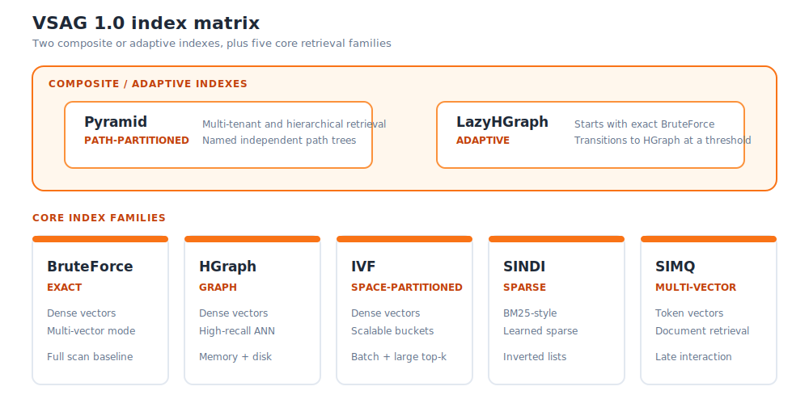

# VSAG 1.0 Release Notes

`v1.0.0` was released on July 12, 2026, the project's third anniversary.

- [Official GitHub Release](https://github.com/antgroup/vsag/releases/tag/v1.0.0)
- [Full v0.18.0...v1.0.0 changelog](https://github.com/antgroup/vsag/compare/v0.18.0...v1.0.0)
- Tag commit: `efdaf17a10e96cdb5222baf558d50dfacbdc672e`

## Overview

VSAG 1.0 is the project's first long-term support (LTS) major release. At the time of its release,
the public `v0.x` history comprised 81 tags from `v0.11` through `v0.18`. `v1.0.0` brings that
work together across dense, sparse, hierarchical, and multi-vector retrieval with structured
filtering.

The official `v1.0.0` release contains 375 changes since `v0.18.0`: 48 features,
134 improvements, 105 bug fixes, and 88 other changes. The broader
`v0.11.0...v1.0.0` history contains 1,252 mainline commits.

This note covers only the APIs and features available in the `v1.0.0` tag.

## Highlights

### Index families

The following matrix groups VSAG 1.0 indexes by role: Pyramid and LazyHGraph provide composite or
adaptive behavior, while the lower row presents the five core index families.

Composite and adaptive indexes:

- The partitioned index **Pyramid** supports assigning one vector to multiple Pyramid paths and
  scoping searches to a selected path for hierarchical and multi-tenant retrieval
  ([PR #2226](https://github.com/antgroup/vsag/pull/2226)).
- The self-scaling graph index **LazyHGraph** starts with exact BruteForce search and converts to
  HGraph after a configurable threshold, avoiding graph-build overhead for small, growing
  collections
  ([PR #2151](https://github.com/antgroup/vsag/pull/2151)).

Core index families:

- The brute-force index **BruteForce** supports exact search for both single-vector and
  multi-vector datasets. It is the exact-search baseline and an option for smaller collections.
- The graph index **HGraph** targets high-recall, low-latency dense-vector search. Since its
  [initial implementation](https://github.com/antgroup/vsag/pull/114), it has added quantization,
  filtering, range and iterator searches, updates, mark and force-removal modes, cache import and
  export, diagnostics, and memory-plus-disk configurations.
- The space-partitioning index **IVF** targets large datasets, batch queries, and large `top-k`
  workloads. It supports quantization, reordering, attribute filters, parallel build and search,
  and on-disk bucket storage. See the original
  [IVF PR](https://github.com/antgroup/vsag/pull/505).
- The sparse-vector index **SINDI** supports BM25-style and learned sparse retrieval, including
  term-ID remapping, index analysis, immutable reads, FP16 sparse values, term-list compaction, and
  a [low-memory immutable build](https://github.com/antgroup/vsag/pull/2424).
- The multi-vector index **SIMQ** targets ColBERT-style late-interaction retrieval. It generates
  candidates at the cluster level, then performs exact MaxSim reranking to balance recall and
  latency
  ([PR #2357](https://github.com/antgroup/vsag/pull/2357)).

For configuration and usage details, see [Indexes](../../indexes/).

### Quantization, data types, and hardware acceleration

VSAG 1.0 supports the following input formats, quantizers, transforms, and hardware-acceleration
paths:

- FP32, INT8, FP16, and BF16 dense inputs, plus sparse and multi-vector datasets, with direct
  FP16/BF16 input support ([PR #1731](https://github.com/antgroup/vsag/pull/1731)).
- SQ4/SQ8 and their uniform variants.
- Product Quantization and PQ FastScan
  ([PR #626](https://github.com/antgroup/vsag/pull/626),
  [PR #691](https://github.com/antgroup/vsag/pull/691)).
- RaBitQ, extended-bit and x+y split base/reorder layouts, FHT/PCA-assisted transforms, and
  dedicated SIMD kernels.
- Transform Quantizer chains and MRL-E dimension reduction.
- x86_64 dispatch across SSE, AVX, AVX2, AVX-512, and selected AMX kernels, plus ARM NEON and SVE.
- AMX acceleration for SQ8U inner product and KMeans BF16 GEMM
  ([PR #2032](https://github.com/antgroup/vsag/pull/2032)).

See [Quantization](../../quantization/) for supported combinations and tuning guidance.

### Search, filtering, and index management

- **Basic search:** `KnnSearch` provides KNN queries, while `RangeSearch` provides range queries
  with an optional result limit.
- **Unified request API:** `SearchRequest` and `Index::SearchWithRequest` use one request object to
  select KNN or range search and carry index-specific JSON parameters, supported filters, and
  diagnostic inputs. In v1.0, HGraph, IVF, and BruteForce implement this interface; supported
  fields vary by index.
- **Filtering:** ID callbacks/`FilterPtr`, bitsets, and SQL-like attribute expressions are
  available. HGraph, IVF, and BruteForce support structured filtering with inverted attribute
  indexes. HGraph also supports iterator filtering and can switch to brute-force search when the
  valid ratio is at or below `hgraph.brute_force_threshold`.
- **Training and model reuse:** `Train`, `Clone`, `ExportModel`, and `Tune` cover standalone
  training, deep copies, trained-model export, and index tuning.
- **Data maintenance and access:** The APIs cover batch removal, mark/force removal,
  ID/vector/attribute updates, source IDs, `extra_info`, index-detail reads, and
  `CalcDistanceById`.
- **Missed-recall diagnosis:** `SearchRequest::expected_labels_` helps HGraph, IVF, and BruteForce
  explain why expected vectors were not recalled. The result `Dataset` carries the reasoning report
  ([PR #1838](https://github.com/antgroup/vsag/pull/1838)).
- **Statistics and capacity planning:** Search, I/O, memory, and index-specific statistics expose
  runtime state, while memory estimates, index introspection, and analysis tools support capacity
  planning and troubleshooting.

Support varies by index; `Index::CheckFeature(IndexFeature)` reports capabilities represented by
`IndexFeature`.

### Serialization and compatibility

VSAG 1.0 maintains two serialization families in parallel. The legacy `Serialize`/`Deserialize`
APIs remain maintained for compatibility with existing integrations. The newer
[streaming serialization APIs](https://github.com/antgroup/vsag/pull/2256) use a header-first,
forward-only format and extend the interface with the following capabilities:

- `SerializeStreaming` writes metadata followed by typed TLV blocks.
- `DeserializeStreaming` restores into an existing compatible, empty index object.
- `Index::Load` reads metadata, creates the matching index, and applies supported placement policy.
- The v1.0 streaming path supports BruteForce, HGraph, IVF, mutable SINDI, and Pyramid. Streaming
  serialization of immutable SINDI indexes is not supported in v1.0.

Both API families remain available, but their formats are **not compatible**; a file must be read
by the matching family. Existing integrations can continue to use the legacy APIs, while new
integrations should prefer the streaming APIs. See
[New Serialization](../../advanced/new_serialization.md) for format and block-version details.

Cross-version index fixtures and the [compatibility check tool](../check_compatibility.md)
provide a repeatable way to validate old artifacts before an upgrade.

### Platforms, bindings, and tooling

- The VSAG core C++ library supports Linux and macOS, with most development and the full validation
  pipeline centered on Linux. Linux x86_64 and AArch64 are both covered by CI, while macOS
  validation currently targets arm64 builds
  ([source build](https://github.com/antgroup/vsag/pull/1439),
  [PR CI](https://github.com/antgroup/vsag/pull/1930)). Prebuilt C++ release archives are currently
  limited to Linux x86_64.
- The Python bindings are packaged as `pyvsag`; v1.0.0 declares support for CPython 3.6-3.14 and
  configures wheel builds for that range. Its build uses native CMake integration
  ([PR #1599](https://github.com/antgroup/vsag/pull/1599)); the bindings also provide broader index
  operations, FP16/BF16 inputs, sparse-vector support, and sparse HDF5 helpers.
- VSAG now includes a C API and
  [Node.js/TypeScript bindings](https://github.com/antgroup/vsag/pull/1812) with quickstart
  examples. Language bindings are released independently; check the corresponding package version
  before use.
- Builds support system OpenBLAS/fmt dependencies, custom dependency mirrors, and installable CMake
  package metadata.
- `eval_performance` supports dense, sparse, and multi-vector datasets. `analyze_index`,
  `check_compatibility`, `visualize_index`, and the HTTP monitor support index analysis,
  compatibility testing, serialization inspection, and monitoring.

### Reliability and validation

Functional and regression tests cover allocation, leaks, out-of-memory paths, and concurrent
build, insertion, search, update, removal, and destruction. CI reinforces these checks with ASan
for memory safety and TSan for data races. Compatibility fixtures validate legacy-index upgrade
paths.

## Compatibility and Upgrade Notes from v0.18

VSAG 1.0 is a major release and includes source-level API changes. Review these points before
upgrading:

1. **`Remove` returns a count and supports batches.** The v0.18 method
   `tl::expected<bool, Error> Remove(int64_t)` now returns
   `tl::expected<uint32_t, Error>`. v1.0 also adds a vector overload and explicit remove modes
   ([PR #1551](https://github.com/antgroup/vsag/pull/1551)). The final API exposes
   `RemoveMode::MARK_REMOVE` and `RemoveMode::FORCE_REMOVE`; HGraph force removal landed in
   [PR #1810](https://github.com/antgroup/vsag/pull/1810).
2. **Unsupported operations usually return an error.** Many default methods that return
   `tl::expected` now return `tl::unexpected` with
   `ErrorType::UNSUPPORTED_INDEX_OPERATION` instead of throwing `std::runtime_error`
   ([PR #2141](https://github.com/antgroup/vsag/pull/2141)). Check the `tl::expected` result before
   calling `.value()`.
3. **Memory-statistics signatures changed.** `GetMemoryUsage` uses `uint64_t`,
   `GetMemoryUsageDetail` returns a `std::unordered_map<std::string, uint64_t>`, and
   `GetEstimateBuildMemory` became `EstimateBuildMemory`
   ([PR #2388](https://github.com/antgroup/vsag/pull/2388)).
4. **Search migration can be incremental.** Prefer `SearchRequest` /
   `SearchWithRequest` for new integration work, but the existing search overloads remain in
   v1.0.
5. **Do not mix serialization families.** Legacy output must use legacy deserialization; streaming
   output must use `DeserializeStreaming` or `Index::Load`.
6. **SINDI heap insertion is automatic.** The legacy `use_term_lists_heap_insert` search parameter
   is ignored. SINDI derives the strategy from `doc_prune_ratio` and `query_prune_ratio`; update
   configurations that forced the old path.
7. **Intel MKL is opt-in.** The default is `OFF`. Enable it with
   `VSAG_ENABLE_INTEL_MKL=ON` through the Makefile or `-DENABLE_INTEL_MKL=ON` through CMake when
   required.

For persisted indexes, validate the exact source and target versions in staging. Serialization
compatibility can differ by index, feature flags, and format family.

## The v0.x Journey to 1.0

`v0.11.0` was VSAG's first formal release after the project was open-sourced. Earlier version
numbers were used only for internal iterations and were not published as GitHub Releases, so this
history begins with `v0.11`.

### Foundations: v0.11-v0.14

- **[v0.11](https://github.com/antgroup/vsag/releases/tag/v0.11.0), September 2024:** established
  the initial HNSW/DiskANN, C++/Python, pre-filter, cosine-distance, locking, and serialization
  baseline.
- **[v0.12](https://github.com/antgroup/vsag/releases/tag/v0.12.0), December 2024:** introduced
  DataCell, I/O, and graph abstractions; HGraph; SQ4/SQ8/INT8 paths; the Engine/factory model; and
  pyvsag packaging.
- **[v0.13](https://github.com/antgroup/vsag/releases/tag/v0.13.0), February 2025:** added
  BruteForce, expanded Pyramid, memory estimation, index feature discovery, filter hints, and the
  `eval_performance` tool.
- **[v0.14](https://github.com/antgroup/vsag/releases/tag/v0.14.0), April 2025:** introduced IVF,
  FP16/BF16 and RaBitQ support, async/buffer I/O, sparse datasets, HGraph `extra_info`, iterator
  filtering, and systematic compatibility checks.

### Expansion: v0.15-v0.18

- **[v0.15](https://github.com/antgroup/vsag/releases/tag/v0.15.0), June 2025:** added
  Train/Clone/ExportModel, PQ/PQ FastScan, attribute expressions, compressed graphs, HGraph merge
  and mark-delete, and self-describing legacy serialization with compatibility CI.
- **[v0.16](https://github.com/antgroup/vsag/releases/tag/v0.16.0), August 2025:** added mmap
  HGraph, SINDI, parallel IVF, attribute updates, raw-vector access, parameter compatibility
  checks, and numerous ABI, concurrency, and legacy-index fixes in subsequent patches.
- **[v0.17](https://github.com/antgroup/vsag/releases/tag/v0.17.0), October 2025:** expanded
  `SearchRequest` to cover the main search cases and added search timeouts, broader `extra_info`,
  Transform Quantizer support, single-query parallel HGraph search, export APIs, and richer SINDI
  lifecycle and statistics support.
- **[v0.18](https://github.com/antgroup/vsag/releases/tag/v0.18.0), January 2026:** added the C API,
  automated Python wheels, sparse-vector Python bindings, on-disk IVF, index detail/search/I/O
  statistics, MRL-E and HGraph tuning, extended RaBitQ, and additional SINDI and Pyramid
  capabilities.

See the [v0.11.0...v1.0.0 comparison](https://github.com/antgroup/vsag/compare/v0.11.0...v1.0.0)
for the complete commit history.

## v1.0 Patch Releases

- **[v1.0.0](https://github.com/antgroup/vsag/releases/tag/v1.0.0) — July 12, 2026:** first
  long-term support major release.

Future `v1.0.x` patches will be added to this section. Their complete PR list and contributor
credits remain on GitHub Releases.

## Acknowledgments

VSAG 1.0 is the result of work by the Ant Group VSAG team and the wider open-source community.
Thank you to every contributor who designed algorithms, implemented features, reported issues,
reviewed changes, improved tests, and wrote documentation.

See the [contributors page](../../misc/contributors.md) and the
[official release](https://github.com/antgroup/vsag/releases/tag/v1.0.0) for contributor details.
