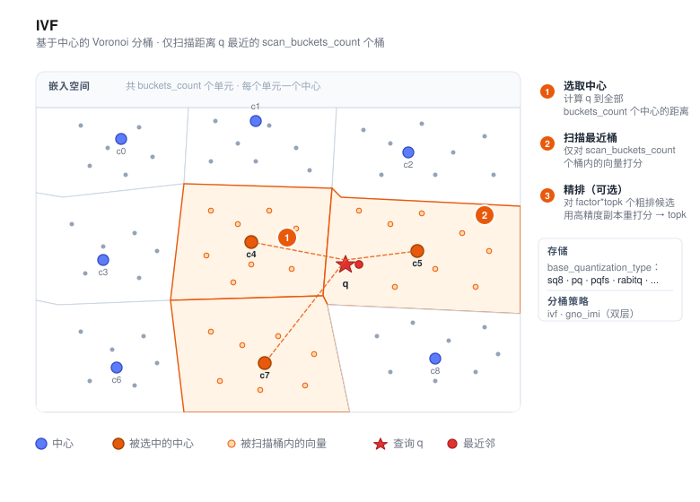

# IVF



IVF（Inverted File，倒排索引）是 VSAG 的 **分桶式** 索引。它在构建时将语料聚类成若干桶，
查询时只扫描与查询距离最近的若干个桶的中心对应的倒排列表，把 O(N) 的线性扫描降为
O(N · `scan_buckets_count` / `buckets_count`)，并通过这两个参数在召回与延迟之间进行权衡。

与图索引相比，IVF 在召回上略有损失，但换来了更低的内存开销、更高的批量吞吐以及更简单的
切片方式——因此在语料非常大（数亿及以上）、内存紧张、或查询可天然并行化的场景中，
IVF 通常是一个更合适的默认选择。

- 源码：`src/algorithm/ivf.{h,cpp}`、`src/algorithm/ivf_parameter.{h,cpp}`
- 示例：[`examples/cpp/106_index_ivf.cpp`](https://github.com/antgroup/vsag/blob/main/examples/cpp/106_index_ivf.cpp)

## 工作原理

1. **聚类。** 在数据集的采样上运行 k-means（或随机采样，`ivf_train_type: "random"`）
   得到 `buckets_count` 个中心（centroid）。
2. **分配。** 每条向量被写入距离最近的中心对应的倒排列表，以配置的粗量化
   （`base_quantization_type`）存储；可选地再保留一份高精度副本（`use_reorder: true`）
   用于精排。
3. **检索。** 查询时先计算查询向量与所有中心的距离，选出最近的 `scan_buckets_count`
   个桶；然后只在这些桶内对向量打分。启用精排时，`factor` 控制从粗排阶段多取多少候选
   再送入精排器重打分。

此外还有一种 **GNO-IMI** 策略（`partition_strategy_type: "gno_imi"`），它把空间按两组
正交中心划分（`first_order_buckets_count` × `second_order_buckets_count`），在超大规模
语料上能得到更精细的分区。

## 快速开始

```cpp
#include <vsag/vsag.h>

std::string params = R"({
    "dtype": "float32",
    "metric_type": "l2",
    "dim": 128,
    "index_param": {
        "buckets_count": 256,
        "base_quantization_type": "sq8",
        "partition_strategy_type": "ivf",
        "ivf_train_type": "kmeans"
    }
})";
auto index = vsag::Factory::CreateIndex("ivf", params).value();

// 构建索引。
auto base = vsag::Dataset::Make();
base->NumElements(n)->Dim(128)->Ids(ids)->Float32Vectors(data)->Owner(false);
index->Build(base);

// 执行检索。
auto query = vsag::Dataset::Make();
query->NumElements(1)->Dim(128)->Float32Vectors(q)->Owner(false);
auto result = index->KnnSearch(
    query, /*topk=*/10,
    R"({"ivf": {"scan_buckets_count": 16}})").value();
```

## 支持的输入数据类型

当前公开的 `Build`、`Add` 和检索路径接收通过 `Dataset::Float32Vectors` 提供的 FP32 向量，`dtype` 应设为 `"float32"`。`base_quantization_type` 选择的是内部编码和存储，不会使 API 接受 FP16/BF16 输入。创建 IVF 索引时不支持 `dtype: "int8"`。

## 构建参数

构建参数放在 `index_param` 下。完整列表请见 [索引参数](../resources/index_parameters.md)。

| 参数 | 类型 | 默认值 | 说明 |
|------|------|--------|------|
| `partition_strategy_type` | string | `"ivf"` | 分桶策略：`ivf`（单层）或 `gno_imi`（双层正交） |
| `buckets_count` | int | `10` | 倒排列表数量（`ivf` 策略下生效） |
| `first_order_buckets_count` | int | `10` | 第一级桶数（`gno_imi` 策略下生效） |
| `second_order_buckets_count` | int | `10` | 第二级桶数（`gno_imi` 策略下生效） |
| `ivf_train_type` | string | `"kmeans"` | 中心训练方式：`kmeans` 或 `random` |
| `route_max_degree` | int | `64` | 路由 HGraph 的最大度数（`ivf` 策略下生效） |
| `route_ef_construction` | int | `300` | 路由 HGraph 的构建搜索宽度（`ivf` 策略下生效） |
| `enable_gpu_build` | bool | `false` | 构建时使用 CUDA 后端（`ivf` 策略下生效），参见 [GPU 加速构建](#gpu-加速构建) |
| `gpu_device_id` | int | `0` | CUDA 设备序号（`ivf` 策略下生效）；机器上不存在该序号时构建留在 CPU |
| `gpu_memory_budget` | int | `0` | 设备工作集的字节上限（`ivf` 策略下生效）；`0` 表示按设备空闲显存推导 |
| `gpu_min_work_threshold` | int | `0` | 值得下放的最小 `count * buckets_count * dim`（`ivf` 策略下生效）；`0` 表示使用标定的默认值 |
| `base_quantization_type` | string | `"fp32"` | `fp32`、`fp16`、`bf16`、`sq8`、`sq4`、`sq8_uniform`、`sq4_uniform`、`pq`、`pqfs`、`rabitq` —— 各量化器细节见[量化章节](../quantization/) |
| `base_pq_dim` | int | `1` | PQ 子空间数（`pq` / `pqfs` 时必填） |
| `rabitq_pca_dim` | int | `0` | `base_quantization_type: "rabitq"` 时可选的 PCA 预处理维度 |
| `rabitq_bits_per_dim_query` | int | `32` | `rabitq` 查询每维位数；允许值为 `4` 或 `32` |
| `rabitq_bits_per_dim_base` | int | `1` | `rabitq` 底库存储码每维位数；允许范围为 `[1, 8]` |
| `rabitq_bits_per_dim_precise` | int | 未设置 | 启用 RaBitQ split storage 并设置补充码（`y`）位数；`rabitq_bits_per_dim_base` 表示过滤码（`x`）位数，且 `x + y <= 8` |
| `rabitq_version` | string | `"standard"` | `rabitq` 布局：`"standard"` 或 `"split_1bit_7bit"` |
| `rabitq_error_rate` | float | `1.9` | `rabitq` 编码的正数误差预算参数 |
| `rabitq_use_fht` | bool | `false` | `rabitq` 二值化前是否启用 FHT 旋转 |
| `fast_encode_rabitq` | bool | `true` | 多 bit `rabitq` 是否使用 CAQ 快速构建；设为 `false` 时使用精确编码 |
| `fast_encode_rabitq_rounds` | int | `6` | CAQ 微调轮数，允许范围 `[1, 32]` |
| `use_residual` | bool | `false` | 是否相对所属 IVF bucket centroid 编码残差 `x-c`。 |
| `use_reorder` | bool | `false` | 是否保留高精度副本用于精排 |
| `precise_quantization_type` | string | `"fp32"` | 精排量化类型（`use_reorder: true` 时使用） |
| `precise_codes_layout` | string | `"flat"` | 精排 codes 的存储布局：`"flat"` 保持旧的一向量一码布局；`"bucket"` 在 basic posting 的相同 bucket 和 offset 保存高精度 code |
| `base_io_type` | string | `"memory_io"` | 粗排向量的存储后端；以 liburing 构建时支持 `uring_io` |
| `base_supplement_io_type` | string | 未设置 | RaBitQ split 补充码可选的 IO 后端 |
| `base_supplement_file_path` | string | 自动派生 | 磁盘型 RaBitQ 补充码可选的文件路径 |
| `precise_io_type` | string | `"block_memory_io"` | 精排向量的存储后端（`memory_io`、`block_memory_io`、`mmap_io`、`buffer_io`、`async_io`、`uring_io`、`reader_io`） |
| `precise_file_path` | string | `""` | 当精排 IO 为磁盘后端时的文件路径 |

`precise_codes_layout: "bucket"` 要求 `use_reorder: true`，支持 `memory_io`、
`block_memory_io`、`buffer_io`、`async_io` 和 `uring_io`
（需要构建环境支持 io_uring）。不支持 `mmap_io` 和 `pqfs` 精排量化。bucket 布局当前
要求 `buckets_per_data: 1`；一个向量分配到多个 bucket 的配置会被拒绝。

对于 `flat` 和 `bucket` 两种布局，序列化后的精排 codes 都可以通过外部 `Reader`
只读加载。向 `Index::Load` 传入 `precise_io_type: "reader_io"` 和 `precise_reader`。
`flat` 布局的 reader 必须恰好对应 `high_precision_codes` block payload，`bucket` 布局
则必须对应 `ivf_precise_bucket` block payload。启用 `precise_enable_read_cache` 后，
`reader_io` 会使用通用读缓存。

```cpp
vsag::LoadParameters load_parameters;
load_parameters.Set("precise_io_type", "reader_io")
    .Set("precise_enable_read_cache", true)
    .Set("precise_cache_total_size", 256ULL * 1024 * 1024)
    .SetReader("precise_reader", precise_codes_reader);
auto loaded = vsag::Index::Load(stream, load_parameters).value();
```

`reader_io` 是加载与查询阶段的只读放置策略。构建时应使用可写的 precise IO，序列化后
再在查询服务加载索引时绑定外部 reader。

`buckets_count` 的经验值一般为 `sqrt(N)` ~ `4 * sqrt(N)`，其中 `N` 是语料规模。

### GPU 加速构建

构建 IVF 索引的开销主要在两处：把训练样本聚类成中心点，以及随后把每条底库
向量分配到桶。聚类量随 `buckets_count` 增长，因为样本量也随之增长
（`train_sample_count` 默认为 `max(65536, 64 * buckets_count)`），而
`ivf_train_type: "kmeans"` 下仅播种一步就是
`O(buckets_count * train_sample_count * dim)` 且为单线程。

当 VSAG 以 `ENABLE_CUDA=ON` 构建时，这两处都可以交给 CUDA 设备。设置
`enable_gpu_build` 即可开启：

```json
{
    "buckets_count": 4096,
    "base_quantization_type": "fp32",
    "partition_strategy_type": "ivf",
    "ivf_train_type": "kmeans",
    "enable_gpu_build": true,
    "gpu_device_id": 0
}
```

有四个环节在设备上执行：聚类内部的 k-means++ 播种、最近中心赋值、中心累加，
以及之后把底库向量分配到桶。`ivf_train_type: "random"` 不做聚类，因此只有
最后一项对它生效。

这四个设置只作用于 `ivf` 分区策略。在 `partition_strategy_type: "gno_imi"` 下
它们会被接受但忽略，与表中其他按策略生效的参数一致，该构建全程留在主机。

**范围。** 只有构建过程改变。检索不受影响：查询仍走图路由，那正是单条查询合适的
形状。四个设置会像其他构建参数一样记入索引 footer，因此两次在其他方面相同的构建
并非逐字节相同；但加载时的兼容性检查会忽略它们：开启后端构建出的索引可以载入任何
其他配置的读取端，包括没有 GPU 的机器，之后按该读取端自己的配置运行。质心与主机
构建的结果可能有细微差异：两条路径的随机选择都来自调用方的随机源，但设备用原子加
对每个簇求和，顺序不固定。

**回退。** 某一环节放弃时由主机接手，过程静默，结果与关闭后端的构建一致。以下情况
会发生回退：VSAG 未启用 CUDA 编译、机器上没有设备、`gpu_device_id` 指定了不存在的
序号、问题规模低于 `gpu_min_work_threshold`、预算放不下某一环节所需，或任何 CUDA
调用失败。构建不会因为这个后端而失败。

有两种情况按设计留在主机。内积度量按点积本身排序，这与设备这一遍所最小化的
量不同，因此它保持图路由。要求可复现归约的构建也会把中心累加留在主机，因为
设备用原子加求和，其顺序不固定。

**显存。** 向量按块流式传输，因此语料不必装入显存，只有中心点和一个数据块需要。
工作集受 `gpu_memory_budget` 限制，默认按设备报告的空闲显存推导，因此同一份
构建在小卡上能跑、在大卡上也用得上。播种只是形态不同：它每选一个中心就扫一遍
整个训练样本，因此样本必须常驻而非分块；预算装不下样本时，播种回到主机，其余
环节仍在设备上。未指定预算时，分块环节取一个默认上限，因为数据块大到足以喂满
设备之后再增大只是更费；播种取设备空闲显存，因为在这里设默认上限只会把大样本
推回主机。

在 SIFT1M 上实测（100 万条底库向量、128 维），以 48 线程的主机构建为基准：

| `buckets_count` | CPU 构建 | GPU 构建 | 加速比 | Recall@10 变化 |
|-----------------|----------|----------|--------|----------------|
| 1000 | 59.45 s | 6.30 s | 9.43x | +0.058 pt |
| 4096 | 167.66 s | 8.02 s | 20.90x | +0.075 pt |
| 16384 | 729.04 s | 27.21 s | 26.79x | +0.079 pt |

加速比随 `buckets_count` 增大，因为聚类在构建中的占比上升。具体倍数取决于机器上
CPU 与 GPU 的相对性能，`gpu_min_work_threshold` 也正是为此而设。

召回率变化的原因是：设备会与每个中心点比较，而主机在两处不是这样。

一处是把底库向量分配到桶。在默认的 `use_route_graph: true` 布局下，这一步走
路由图检索，是近似的。在 20000 条 64 维随机向量上，两条路径在 `buckets_count`
为 16 时结果完全一致；为 256 和 1000 时，分别约有 10% 和 12% 的向量落入不同的
桶，且这些情形中设备每一次给出的都是更近的中心点，到所属中心点的平均距离分别
改善不到 1% 和约 2%。这些数字在不同次运行间会小幅浮动，因为训练没有固定随机种
子、每次聚类结果不同；在单位化与未单位化的随机数据上都成立。扫描布局两条路径
都是精确的，不会变化。

另一处是聚类，在中心点超过 10000 时，主机为控制训练开销改用在中心点上做图检索。

所以开启后端不只是更快，赋值质量也略好。但支撑这一点的是上面的距离比较，不是
召回率那一列：表中每种配置只跑了一次，而两个分别训练的索引之间，召回率的浮动
大于表里给出的差值。在 50000 条 128 维随机向量上，四次相同设置的构建，召回率
跨度达到整整一个百分点，而表里的差值只有百分点的百分之几。那一列应读作"没有
退化"，而不是"测到了增益"。在上述规模以下，两者只在某点到两个中心点的距离于
浮点舍入意义上相等时才不同。

## RaBitQ split storage

将粗排和精排量化器都设为 `rabitq`，并把存储精度拆成过滤码
（`x`）和补充码（`y`）：

```json
{
    "base_quantization_type": "rabitq",
    "precise_quantization_type": "rabitq",
    "rabitq_bits_per_dim_query": 32,
    "rabitq_bits_per_dim_base": 3,
    "rabitq_bits_per_dim_precise": 5,
    "use_reorder": true
}
```

IVF 将 `x` bit filter planes 保存为 bucket-local 32-vector packed blocks，并单独
保存 `y` bit supplement。默认 `candidate_reorder` 只扫描 packed x bits，保留
`factor * topk` 个候选，同时携带 byte-LUT 量化得到的 x-bit 内积以及候选的
source bucket、offset 和 version。正常重排直接把保存的 x-bit 内积与 y-bit
supplement contribution 合并，不重新读取或 unpack x-bit planes，也不从距离 hint
反推内积。

对 residual L2 candidate 检索，所有已路由 bucket 共享一份由原始变换 query
构建的 LUT。每个 lane 的 factors 用于恢复原始 filter-code contribution，并在
原始 query 下与 supplement 合并；正常重排不再构建 `q-c` computer。只有保存值
或 factors 非法、source provenance 过期，或 FastScan lane 未产生有效结果时，
正确性 fallback 才会 unpack x bits。

split 配置要求 `x >= 1`、`y >= 1`、`x + y <= 8`、
`rabitq_bits_per_dim_query: 32`、`use_reorder: true` 和
`buckets_per_data: 1`。split storage 暂不支持桶内图
（`graph_build_threshold > 0`）。同构 IO 支持 `memory_io`、
`block_memory_io`、`buffer_io`、`async_io`、`mmap_io` 和
`reader_io`；混合 IO 支持过滤码使用 `block_memory_io`、补充码使用
`async_io`。

## 检索参数

检索参数放在 `ivf` 子对象下：

| 参数 | 类型 | 默认值 | 说明 |
|------|------|--------|------|
| `scan_buckets_count` | int | —（必填） | 每次查询扫描的桶数，须 ≤ `buckets_count`（`disable_bucket_scan` 为 true 时可更大，空槽位补 `-1`） |
| `disable_bucket_scan` | bool | `false` | 返回桶 ID 及到桶中心距离，不扫描桶内向量。支持批量查询。 |
| `factor` | float | `2.0` | 启用精排时，粗排阶段会预取 `factor * topk` 个候选再重打分 |
| `enable_reorder` | bool | `true` | 即使索引构建时启用了 reorder，也可以在单次请求里设为 `false` 跳过最终精排 |
| `parallelism` | int | `1` | 单次查询内扫描桶时使用的线程数 |
| `timeout_ms` | double | `+∞` | 单次查询最长耗时（毫秒），超时会返回当前的部分结果 |

```cpp
auto result = index->KnnSearch(
    query, topk,
    R"({"ivf": {"scan_buckets_count": 32, "factor": 2.0, "parallelism": 4}})").value();
```

```cpp
auto fast_result = index->KnnSearch(
    query, topk,
    R"({"ivf": {"scan_buckets_count": 32, "factor": 2.0, "enable_reorder": false}})").value();
```

## 何时选择 IVF

- 超大规模语料（数亿及以上），工作集无法完全放入内存。
- 对每秒查询数（QPS）敏感、对单次延迟相对宽松的批量或高吞吐场景。
- 内存紧张的部署，可使用激进的量化方案（`sq8`、`sq4_uniform`、`pq`、`pqfs`）配合
  `use_reorder` 恢复召回。
- 对切片友好的部署：桶天然映射到分片或磁盘块。

对于延迟敏感、要求高召回的稠密 embedding 场景，请优先比较 [HGraph](hgraph.md)。

## 相关文档

- [创建索引](../guide/create_index.md)
- [索引参数](../resources/index_parameters.md)
- [序列化格式](../advanced/serialization.md)
