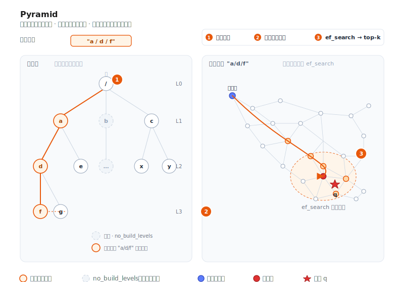

# Pyramid



Pyramid 是 VSAG 的 **层级路径分区** 图索引。每条向量都附带一个路径字符串（例如
`"a/d/f"`），Pyramid 会按路径树为每个节点构建一个子图；查询时提供一个路径前缀，
检索即被限定在相应的子树内。

这种设计非常适合多租户部署、标签分区的物料库，或者任何“一个逻辑索引服务多个群体、
群体之间不允许结果交叉”的场景。

- 源码：`src/algorithm/pyramid.{h,cpp}`、`src/algorithm/pyramid_zparameters.{h,cpp}`
- 示例（单层级）：[`examples/cpp/107_index_pyramid.cpp`](https://github.com/antgroup/vsag/blob/main/examples/cpp/107_index_pyramid.cpp)
- 示例（多层级）：[`examples/cpp/112_index_pyramid_multi_hierarchy.cpp`](https://github.com/antgroup/vsag/blob/main/examples/cpp/112_index_pyramid_multi_hierarchy.cpp)

## 工作原理

1. **路径树。** 每条向量在 ID 之外还携带一个 `path`，分隔符为 `/`
   （例如 `"tenant_a/lang_en/topic_news"`）。Pyramid 会为构建期间出现过的每个路径前缀
   维护一个子索引。
2. **按层构建子图。** 默认情况下每一层都会独立构建一张近邻图。可以用 `no_build_levels`
   跳过那些太小或太粗、不适合构图的层级——这些层级仍作为透传容器存在，但检索会退化为
   线性扫描。
3. **图的构建。** 每个子图与 HGraph 采用同一套机制：`nsw` 插入或 `odescent`，并通过
   `graph_iter_turn`、`neighbor_sample_rate`、`alpha` 控制构图剪枝。底层向量按
   `base_quantization_type` 存储；启用精排时另外保留一份高精度副本。
4. **检索。** 查询向量同样要附带路径。搜索会顺路径树向下走到最具体匹配查询路径的子图，
   然后在该子图内执行图检索（`ef_search`；中间层由 `subindex_ef_search` 控制）。

## 快速开始

```cpp
#include <vsag/vsag.h>

std::string params = R"({
    "dtype": "float32",
    "metric_type": "l2",
    "dim": 128,
    "index_param": {
        "base_quantization_type": "sq8",
        "max_degree": 32,
        "alpha": 1.2,
        "graph_type": "odescent",
        "graph_iter_turn": 15,
        "neighbor_sample_rate": 0.2,
        "no_build_levels": [0, 1],
        "use_reorder": true,
        "build_thread_count": 16
    }
})";
auto index = vsag::Factory::CreateIndex("pyramid", params).value();

// 构建时为每条向量提供路径。
auto base = vsag::Dataset::Make();
base->NumElements(n)
    ->Dim(128)
    ->Ids(ids)
    ->Paths(paths)          // std::string* 长度为 n，例如 "a/d/f"
    ->Float32Vectors(data)
    ->Owner(false);
index->Build(base);

// 按路径前缀执行检索。
std::string query_path = "a/d";
auto query = vsag::Dataset::Make();
query->NumElements(1)
    ->Dim(128)
    ->Float32Vectors(q)
    ->Paths(&query_path)
    ->Owner(false);
auto result = index->KnnSearch(
    query, /*topk=*/10,
    R"({"pyramid": {"ef_search": 100}})").value();
```

## 构建参数

构建参数放在 `index_param` 下。

| 参数 | 类型 | 默认值 | 说明 |
|------|------|--------|------|
| `base_quantization_type` | string | — | 底层量化类型（`fp32`、`fp16`、`bf16`、`sq8`、`sq4`、`sq8_uniform`、`sq4_uniform`、`pq`、`pqfs`、`rabitq`）。各量化器细节见[量化章节](../quantization/README.md)。 |
| `max_degree` | int | `64` | 子图内节点的最大出度 |
| `graph_type` | string | `"nsw"` | `nsw` 或 `odescent` |
| `ef_construction` | int | `400` | `nsw` 构图时的候选集大小 |
| `alpha` | float | `1.2` | 构图剪枝系数 |
| `graph_iter_turn` | int | — | ODescent 迭代轮数（`graph_type: "odescent"` 时生效） |
| `neighbor_sample_rate` | float | — | ODescent 的邻居采样比率 |
| `no_build_levels` | int[] | `[]` | 跳过构图的层级（从根节点开始的 0-based 下标） |
| `use_reorder` | bool | `false` | 是否保留高精度副本用于精排 |
| `precise_quantization_type` | string | `"fp32"` | 精排使用的量化类型 |
| `index_min_size` | int | `0` | 子索引的最小规模；小于该值的分区会退化为线性扫描 |
| `support_duplicate` | bool | `false` | 是否允许重复 ID |
| `build_thread_count` | int | `1` | 构建阶段并发线程数 |
| `hierarchies` | array | `[]` | 命名层级定义。每个元素可以是字符串（继承全部顶层参数）或对象（含 `name` 及可选覆盖参数：`max_degree`、`ef_construction`、`alpha`、`no_build_levels`、`index_min_size`）。设置后激活多层级模式，每个层级维护独立的路径树。 |

## 检索参数

检索参数放在 `pyramid` 子对象下：

| 参数 | 类型 | 默认值 | 说明 |
|------|------|--------|------|
| `ef_search` | int | `100` | 叶子层子图检索的候选集大小 |
| `subindex_ef_search` | int | `50` | 沿路径向下遍历中间子图时的候选集大小 |
| `hierarchies` | string[] | `[]` | 指定检索哪个层级。空数组表示使用默认（匿名）层级。 |
| `hierarchy_op` | string | `"single"` | 多层级结果合并方式：`single`（检索单个层级）、`union`、`intersection`。**注意：** `union` 和 `intersection` 尚未实现——设置后 `KnnSearch`/`RangeSearch` 会返回错误。 |

```cpp
auto result = index->KnnSearch(
    query, topk,
    R"({"pyramid": {"ef_search": 200, "subindex_ef_search": 80}})").value();
```

## 多层级支持 (Multi-Hierarchy)

一个 Pyramid 索引可以同时维护**多棵独立的路径树**，每棵树由名称标识（如
`"site"`、`"category"`）。所有层级共享向量 ID 和数据——只有路径不同。每个层级可以
选择性地覆盖图构建参数。

当同一组向量需要沿多个维度同时分区时，这个特性非常有用。例如，一个电商平台可能
需要按**站点**（`site-a/lang-en`）和按**品类**（`electronics/phones`）同时分区，
检索时可以独立选择任一层级。

### 构建配置

在 `index_param` 中添加 `hierarchies` 数组。每个元素可以是：
- **字符串**（继承全部顶层参数）：`"site"`
- **对象**（含 `name` 和可选的参数覆盖）：
  `{"name": "category", "max_degree": 64, "no_build_levels": [0]}`

可按层级覆盖的参数：`max_degree`、`ef_construction`、`alpha`、`no_build_levels`、
`index_min_size`。

```json
{
    "dtype": "float32",
    "metric_type": "l2",
    "dim": 128,
    "index_param": {
        "base_quantization_type": "sq8",
        "max_degree": 32,
        "alpha": 1.2,
        "graph_type": "odescent",
        "graph_iter_turn": 15,
        "neighbor_sample_rate": 0.2,
        "no_build_levels": [0, 1],
        "use_reorder": true,
        "build_thread_count": 16,
        "hierarchies": [
            "site",
            {"name": "category", "max_degree": 64, "no_build_levels": [0]}
        ]
    }
}
```

### 命名层级的 Dataset API

使用重载方法 `Paths(hierarchy_name, paths)` 为每个层级设置路径。所有层级共享同一份
`Ids()` 和 `Float32Vectors()`：

```cpp
auto base = vsag::Dataset::Make();
base->NumElements(n)
    ->Dim(128)
    ->Ids(ids)
    ->Float32Vectors(data)
    ->Paths("site", site_paths)         // std::string* 长度为 n
    ->Paths("category", category_paths) // 第二个层级的独立路径
    ->Owner(false);
index->Build(base);
```

### 检索指定层级

通过检索参数中的 `"hierarchies"` 指定要检索的层级。查询 Dataset 也需要在对应的
层级名称上设置路径：

```cpp
auto query = vsag::Dataset::Make();
query->NumElements(1)
    ->Dim(128)
    ->Float32Vectors(q)
    ->Paths("site", &query_path)   // 指向 "site" 层级
    ->Owner(false);

auto result = index->KnnSearch(
    query, /*topk=*/10,
    R"({"pyramid": {"ef_search": 100, "hierarchies": ["site"]}})").value();
```

### 增量插入 (Add)

`Add()` 的用法与 `Build()` 一致——提供命名路径，索引会自动插入到所有匹配的层级：

```cpp
auto new_data = vsag::Dataset::Make();
new_data->NumElements(count)
    ->Dim(128)
    ->Ids(new_ids)
    ->Float32Vectors(new_vectors)
    ->Paths("site", new_site_paths)
    ->Paths("category", new_cat_paths);
index->Add(new_data);
```

### 范围检索 (RangeSearch)

RangeSearch 同样支持通过检索参数选择层级：

```cpp
auto result = index->RangeSearch(
    query, /*radius=*/20.0f,
    R"({"pyramid": {"ef_search": 100, "hierarchies": ["category"]}})").value();
```

### 序列化与反序列化

多层级索引的序列化和反序列化完全透明。序列化格式包含所有层级名称及其图结构：

```cpp
// 序列化
auto binary_set = index->Serialize().value();

// 反序列化到新索引（必须使用相同的构建参数）
auto new_index = vsag::Factory::CreateIndex("pyramid", build_params).value();
new_index->Deserialize(binary_set);
```

## 何时选择 Pyramid

- 多租户服务：每个租户只能看到自己分区的结果，且希望避免为每个租户单独维护一份索引。
- 带有层级标签的物料库（语言 / 地域 / 品类），查询永远限定在某个已知的前缀下。
- 小分区非常多的负载：可以用 `no_build_levels` 与 `index_min_size` 跳过那些小到不值得
  构图的分区。

如果不需要按路径限定查询范围，[HGraph](hgraph.md) 更简洁，性能通常也更高。

## 标记删除

Pyramid 支持 `RemoveMode::MARK_REMOVE`。调用 `Remove(ids)`（默认模式）会为给定的 id
打上删除标记：它们会从后续检索结果中排除，`GetNumElements()` 相应减少，
`GetNumberRemoved()` 返回累计删除数量。删除不存在或已删除的 id 不会有任何效果。
`RemoveMode::FORCE_REMOVE` 不支持，调用会返回错误。

被标记删除的向量在索引重建前仍占用内存，空间不会被物理回收。

## 相关文档

- [创建索引](../guide/create_index.md)
- [索引参数](../resources/index_parameters.md)
- [图索引增强](../advanced/enhance_graph.md)
- [HGraph](hgraph.md)
