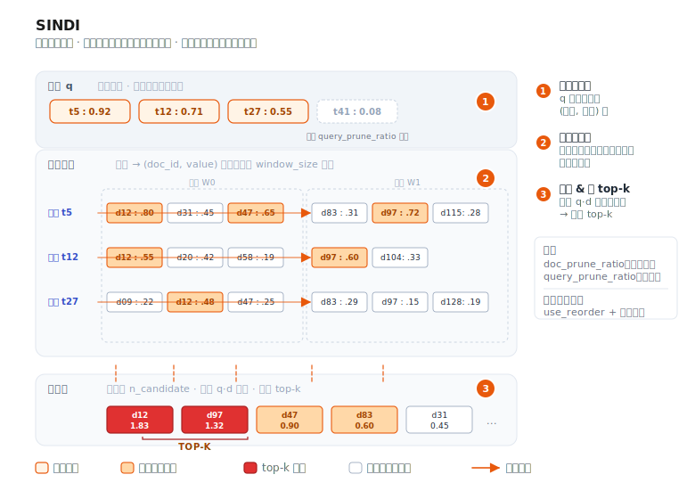

# SINDI



SINDI（**S**parse **IN**verted **D**ense **I**ndex）是 VSAG 面向 **稀疏向量** 的索引——
例如 BM25、SPLADE 以及其他学习稀疏（learned sparse）编码器产出的向量。与稠密索引
（HGraph、IVF）不同，SINDI 直接在“词项-权重”对上工作，是 VSAG 中唯一接受
`dtype: "sparse"` 的索引。

- 源码：`src/algorithm/sindi/`
- 示例：[`examples/cpp/109_index_sindi.cpp`](https://github.com/antgroup/vsag/blob/main/examples/cpp/109_index_sindi.cpp)

## 工作原理

1. **基于窗口的倒排表。** 文档按固定窗口大小（`window_size`）分组，每个窗口独立维护一套
   倒排表——即“词项 → `(doc_id, value)` 列表”的映射。
2. **可选的剪枝与量化。** 构建时可通过 `doc_prune_ratio` 按文档粒度丢弃权重最低的词项；
   通过 `use_quantization` 压缩词项权重以进一步节省内存。
3. **打分。** 检索时，SINDI 遍历查询向量的非零项，按窗口访问对应的倒排表，使用大小为
   `n_candidate` 的大顶堆聚合得分，最后取 top-k。启用 `use_reorder` 时，候选会在高精度
   扁平副本上重打分。

返回的距离为 `1 - inner_product`，使结果与稠密索引一样按升序排序。

## 快速开始

```cpp
#include <vsag/vsag.h>

std::string params = R"({
    "dtype": "sparse",
    "metric_type": "ip",
    "dim": 1024,
    "index_param": {
        "term_id_limit": 30000,
        "window_size": 50000,
        "doc_prune_ratio": 0.0,
        "use_quantization": false,
        "use_reorder": false,
        "remap_term_ids": false
    }
})";
auto index = vsag::Factory::CreateIndex("sindi", params).value();

// 使用 SparseVector 构建数据集。
auto base = vsag::Dataset::Make();
base->NumElements(n)
    ->SparseVectors(sparse_vectors)  // vsag::SparseVector*
    ->Ids(ids)
    ->Owner(false);
index->Build(base);

// 执行检索。
auto query = vsag::Dataset::Make();
query->NumElements(1)->SparseVectors(&query_vec)->Owner(false);
auto result = index->KnnSearch(
    query, /*topk=*/10,
    R"({"sindi": {"n_candidate": 100}})").value();
```

## 构建参数

构建参数放在 `index_param` 下。`dtype` **必须** 为 `"sparse"`，`metric_type` **必须**
为 `"ip"`。

| 参数 | 类型 | 默认值 | 说明 |
|------|------|--------|------|
| `dim` | int | —（必填） | 单条稀疏向量允许的最大非零项数量，**不是** 词表大小 |
| `term_id_limit` | int | `1000000` | 词项 ID 的上界（应 ≥ 最大词项 ID + 1，最高 50 000 000） |
| `window_size` | int | `50000` | 每个窗口容纳的文档数（取值范围 10 000 – 60 000） |
| `doc_prune_ratio` | float | `0.0` | 构建阶段按文档丢弃权重最低词项的比例（0.0 – 0.9） |
| `use_quantization` | bool | `false` | 是否量化词项权重以降低内存；开启后使用 8-bit 标量量化（SQ8） |
| `use_reorder` | bool | `false` | 是否保留一份高精度扁平副本用于精排（内存约翻倍） |
| `remap_term_ids` | bool | `false` | 是否在建索引前重映射词项 ID，适用于词项 ID 很稀疏或存在大量空洞的词表 |
| `avg_doc_term_length` | int | `100` | 仅用于内存估算 |

> **`dim` 与 `term_id_limit` 的区别。** 对于稀疏向量 `{0:0.1, 2:0.5, 177:0.8}`，
> `dim` 为 `3`（三个非零项），而 `term_id_limit` 至少应为 `178`（最大词项 ID + 1）。
> `term_id_limit` 要按词表大小估计，这是使用时最常见的坑。

## 检索参数

检索参数放在 `sindi` 子对象下：

| 参数 | 类型 | 默认值 | 说明 |
|------|------|--------|------|
| `n_candidate` | int | `0` | 候选堆大小。为 `0` 时自动取 `SPARSE_AMPLIFICATION_FACTOR · topk`（500 倍）；若显式设置，须满足 `1 ≤ n_candidate ≤ SPARSE_AMPLIFICATION_FACTOR · topk` |
| `query_prune_ratio` | float | `0.0` | 查询时丢弃权重最低查询项的比例（0.0 – 0.9） |
| `term_prune_ratio` | float | `0.0` | 查询时丢弃倒排表中低权项的比例（0.0 – 0.9） |
| `use_term_lists_heap_insert` | bool | `true` | 按倒排表顺序做堆插入，通常更快 |

```cpp
auto result = index->KnnSearch(
    query, topk,
    R"({"sindi": {"n_candidate": 200, "query_prune_ratio": 0.1}})").value();
```

## 何时选择 SINDI

- 使用 BM25、SPLADE、uniCOIL 等学习稀疏编码器的稀疏检索场景。
- 稠密 + 稀疏的混合检索管线：SINDI 负责稀疏一路，HGraph / IVF 负责稠密 embedding。
- 稀疏语料的内存受限部署：`use_quantization: true` 大致能把内存减半，略损召回；
  `use_reorder: true` 以内存换召回。

SINDI **不支持** 稠密向量，只支持内积相似度。范围检索与基于 ID 的过滤均已支持，
具体用法参见示例代码。

## 实践建议

- 中文数据集的稀疏向量，推荐使用 BGE-M3 编码；英文数据集更常见的默认选择是
    SPLADE。
- BGE-M3 同时支持 sparse 和 dense 输出。当前 SINDI 负责稀疏一路，VSAG 未来计划
    支持稀疏与稠密融合打分检索。
- 稀疏向量不能完全替代 BM25 全文检索。实践中，BM25 + 稀疏向量 + 稠密向量的三路
    召回通常优于任意两路组合。
- 在索引层面，SINDI 也可以承载 BM25 风格打分：查询侧用逆文档频率作为词项权重，
    文档侧用词频等特征计算出的词项权重作为向量值即可。

## 常用配置

1. 扁平暴力搜索索引。倒排索引保留全部非零项（`doc_prune_ratio: 0.0`），不保留正排索引
    重排（`use_reorder: false`），不开启量化（`use_quantization: false`）。这是最直接的
     高召回基线。
2. 剪枝高精索引。构建时剪掉大部分低权重词项（`doc_prune_ratio: 0.4`），保留正排索引
     用于重排（`use_reorder: true`），并开启量化减少倒排索引内存
     （`use_quantization: true`）。这是常见的精度与内存折中配置。
3. 超大稀疏词表支持。对于词项 ID 在 `uint32` 范围内非常稀疏的场景，例如基于哈希的
     分词器、外部词表 ID，或存在大量空白区间的词表，建议设置 `remap_term_ids: true`。
     这样可以避免管理大量空倒排列表带来的内存浪费，也能降低触达 `term_id_limit`
     上限的风险。

## 标记删除

SINDI 支持 `RemoveMode::MARK_REMOVE`。调用 `Remove(ids)`（默认模式）会为给定的 id
打上删除标记：它们不再出现在检索结果中，`GetNumElements()` 相应减少，
`GetNumberRemoved()` 返回累计删除数量。删除不存在或已删除的 id 不会有任何效果。
`RemoveMode::FORCE_REMOVE` 不支持，调用会返回错误。

被标记删除的文档在索引重建前仍占用内存，空间不会被物理回收。

## 相关文档

- [创建索引](../guide/create_index.md)
- [索引参数](../resources/index_parameters.md)
- [k-近邻搜索](../guide/knn_search.md)
