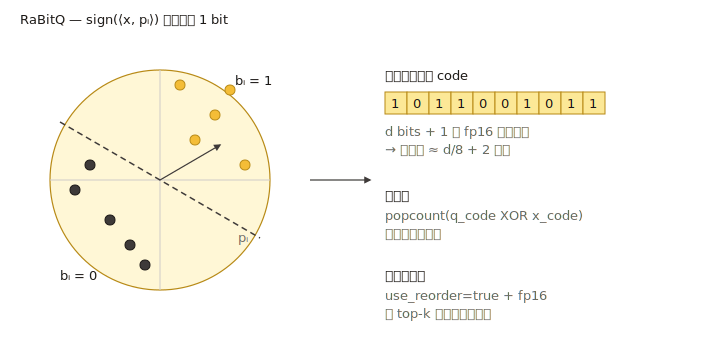

# RaBitQ

`rabitq` 是 VSAG 的二值 / 低比特量化器。默认模式下每个坐标用 **1 比特**
编码，给出所有内建量化器中最高的压缩率。在 HGraph 上，`x+y` split 模式把
底库码拆成 `x` 个过滤 bit 和 `y` 个 supplement bit：图遍历只使用 filter code，
重排 / full-distance 阶段只额外读取 supplement bits。



> 实现：`src/quantization/rabitq_quantization/rabitq_quantizer.cpp`，
> 参数文件 `rabitq_quantizer_parameter.cpp`。
> HGraph split 的完整存储布局、lower bound 公式和 IO 模式见
> [RaBitQ x+y Split](rabitq_split.md)。

## 何时使用

- **最强压缩。** 1 比特码是稠密向量可能的最小存储。
- **高维嵌入**——旋转 + 二值化后仍能保留足够近邻搜索所需的几何信息。
- 配合精确重排存储（`fp16` / `fp32`）——标准做法就是 "RaBitQ + 重排"，
  因为 1 比特距离本身噪声较大。

为获得最佳精度，请同时启用 `rabitq_use_fht: true`，或者用
[量化变换](../advanced/quantization_transform.md) 链路如
`"pca, rom, rabitq"` 包一层。

## 内存代价（仅码）

- `rabitq_bits_per_dim_base = 1`：每向量 `ceil(dim / 8)` 字节。`dim = 768`
  时为 96 字节（对比 fp32 的 3072 → 小 32×）。
- HGraph 上 `rabitq_bits_per_dim_base = x` 且
  `rabitq_bits_per_dim_precise = y`：split 模式约存储
  `(x + y) * dim / 8` 字节的 RaBitQ code。例如 `3+5` 约为每向量 `dim`
  字节。

## 参数

| Key | 类型 | 默认 | 含义 |
| --- | --- | --- | --- |
| `pca_dim` | int | `0`（= 输入维度） | RaBitQ 内部可选的 PCA 预处理维度。`0` 表示不做 PCA 降维（`rabitq_quantizer_parameter.cpp:30-32`）。 |
| `rabitq_bits_per_dim_query` | int | `32` | 搜索时**查询**的每维位数。允许值：`4` 或 `32`（`rabitq_quantizer_parameter.cpp:38-43`）。 |
| `rabitq_bits_per_dim_base` | int | `1` | standard RaBitQ 下表示底库码每维位数；HGraph `x+y` split 下，这个外部 key 表示 `x`，即图遍历过滤阶段使用的 filter bits。范围 `[1, 8]`。 |
| `rabitq_bits_per_dim_precise` | int | 未设置 | HGraph-only split 模式 key。和 `base_quantization_type: "rabitq"`、`precise_quantization_type: "rabitq"` 一起出现时表示 `y`，即重排 / full-distance 阶段读取的 supplement bits。要求 `x + y <= 8`。 |
| `rabitq_error_rate` | float | `1.9` | HGraph split 搜索的默认 lower-bound 误差倍率；必须为有限正数，也可以在 `hgraph` 搜索参数中按次覆盖。 |
| `use_fht` | bool | `false` | `true` 时在二值化前应用快速 Hadamard 变换旋转。以 O(dim log dim) 的廉价代价提升各向异性数据上的精度（`rabitq_quantizer_parameter.cpp:76-78`）。 |

各索引页会把 RaBitQ 设置暴露为 `index_param` 顶层 key：HGraph 暴露
`rabitq_pca_dim`、`rabitq_bits_per_dim_query`、`rabitq_bits_per_dim_base`、
`rabitq_bits_per_dim_precise`、`rabitq_error_rate`、`rabitq_use_fht`；IVF
暴露 `rabitq_pca_dim`、`rabitq_bits_per_dim_query`、
`rabitq_bits_per_dim_base`、`rabitq_version`、`rabitq_error_rate`、
`rabitq_use_fht`；Pyramid 为底层量化器暴露 PCA、底库/查询位数和 FHT
相关 key。其中 `rabitq_use_fht` 是索引层对量化器内部 `use_fht` key
的别名，会由索引层重写。

```json
{
    "dtype": "float32",
    "metric_type": "l2",
    "dim": 768,
    "index_param": {
        "base_quantization_type": "rabitq",
        "rabitq_use_fht": true,
        "rabitq_pca_dim": 0,
        "rabitq_bits_per_dim_base": 1,
        "rabitq_bits_per_dim_query": 32,
        "max_degree": 32,
        "ef_construction": 300,
        "use_reorder": true,
        "precise_quantization_type": "fp32"
    }
}
```

切换到高精度的 `x+y` split 模式：把 base 和 precise 量化都设置为 RaBitQ，
并提供 `rabitq_bits_per_dim_precise`。HGraph 会自动选择 split datacell。
下面例子中，图遍历使用 `x = 3` 个 filter bits，重排只读取 `y = 5` 个
supplement bits：

```json
{
    "base_quantization_type": "rabitq",
    "precise_quantization_type": "rabitq",
    "rabitq_bits_per_dim_base": 3,
    "rabitq_bits_per_dim_precise": 5,
    "rabitq_use_fht": true
}
```

## 训练

设置了 `NEED_TRAIN`。训练学习让 1 比特编码均衡的旋转与逐维统计。可选的
FHT 旋转是固定的（无需学习），因此不增加训练代价；PCA 预处理（`pca_dim
> 0`）会训练一个投影矩阵。

## 度量兼容性

`l2`、`ip`、`cosine`——全部支持。二值距离内核是对 XOR 后的码字做 popcount；
对 `ip` / `cosine`，实现还会追踪一份残差范数，使内积估计无偏。

## 实践要点

- **始终启用重排**，除非你已经验证 1 比特召回在你的数据上可接受。
  `use_reorder: true` + `precise_quantization_type: "fp32"` 是稳妥默认。
- **先旋转。** 对未归一化数据，设 `rabitq_use_fht: true`，或在 `tq` 链路
  中包含 `rom` / `fht`。
- **精度优先时用 split 模式。** HGraph `x+y` split 保留 `x` bit 快速
  过滤路径，再添加 `y` 个 supplement bits 用于重排；相对纯 1 比特，使用
  更多总 bit 时召回明显更高。

## 相关页面

- [量化变换](../advanced/quantization_transform.md)
- [HGraph 索引](../indexes/hgraph.md)
- [RaBitQ x+y Split](rabitq_split.md)
- [量化总览](README.md)
