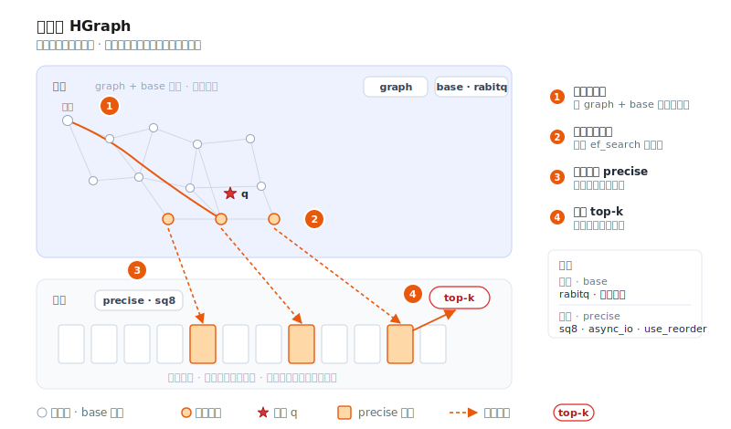

# 磁盘索引最佳实践



当数据规模增长到内存放不下全量向量时，把最冷、最大的那部分索引下沉到 SSD，是控制成本最直接的
手段。VSAG 让索引的每个部分各自选择存储后端，从而实现热数据留内存、冷数据从磁盘读取。本文介绍
**[HGraph](../indexes/hgraph.md) + 磁盘 IO**，给出可直接复制的配置、容量模型与调优
清单。

> 这里的“磁盘索引”指**把索引数据分层存放在内存与磁盘之间**，与“向量 + 标量属性”的混合检索无关；
> 后者请参见[属性过滤（混合搜索）](../advanced/attribute_filter.md)。

## 什么时候该上磁盘

数据规模大并不必然要上磁盘。先用下面几个信号判断：

| 信号 | 纯内存即可 | 考虑磁盘 |
|------|-----------|---------|
| 数据规模 | 千万级及以内 | 亿级 / 十亿级 |
| 全量 `fp32` 是否放得下内存 | 放得下 | 放不下 |
| 延迟预算 | 亚毫秒、极敏感 | 几毫秒～十几毫秒可接受 |
| 成本结构 | 内存成本可接受 | 希望用 SSD 替换大部分内存 |

一个快速的内存估算：全量 `fp32` 副本约占用 `N × dim × 4` 字节。例如 `1e9 × 128 × 4 ≈ 512 GB`、
`1e8 × 768 × 4 ≈ 307 GB`——这类规模在单机内存里几乎放不下，正是磁盘索引的目标场景。

磁盘路线的代价是每次查询会引入若干次随机读 I/O，因此**延迟会高于纯内存索引**。如果你的服务要求
亚毫秒级延迟且数据能压缩进内存，优先考虑纯内存的 [HGraph](../indexes/hgraph.md) + 量化。

## 核心思想

VSAG 的磁盘路线遵循同一原则：**内存放小而近似的表示用于导航，磁盘放大而精确的表示用于
排序。** 图遍历只访问内存中的近似量化码；随后仅对少量入围候选，用从磁盘读回的
精确副本做重排（reorder）。由于磁盘读取只发生在最后、且只针对少量候选，I/O 成本被限制在很小
范围，而召回则由精确重排补回。

## HGraph 如何分层存储

HGraph 把一个索引拆成若干个相互独立的 **cell（数据单元）**，每个 cell 都能单独指向自己的
**IO 后端**。这正是“热数据在内存、冷数据在磁盘”的实现基础：

| Cell | 存放内容 | 访问模式 | 建议放置 |
|------|---------|---------|---------|
| `graph` | 邻近图的邻接表 | 每一跳都读 | 内存（内存紧张时可用 `mmap_io`） |
| `base` | 用于遍历和剪枝的量化码 | 每一跳都读 | 内存 |
| `precise` | 用于重排的高精度副本（`use_reorder`） | 只为少量入围候选读取 | **磁盘** |
| `raw_vector` | 可选的原始向量（`store_raw_vector`） | 很少访问，如 `cosine` / 精确计算 | 内存或磁盘 |

可分配给 cell 的 IO 后端：

| 后端（`*_io_type`） | 位置 | 是否需要 `*_file_path` | 说明 |
|---------------------|------|------------------------|------|
| `memory_io` | 内存（连续） | 否 | 基础内存存储 |
| `block_memory_io` | 内存（分块分配） | 否 | 大 cell 的默认后端 |
| `buffer_io` | 磁盘（带缓冲 `pread`） | 是 | 通用磁盘读取，各平台可用 |
| `mmap_io` | 磁盘（mmap + 页缓存） | 是 | 工作集能放入页缓存时接近内存速度 |
| `async_io` | 磁盘（Linux libaio） | 是 | 高并发磁盘读；**仅限 Linux + libaio**，否则回退 `buffer_io` |
| `reader_io` | 自定义 `Reader` | 否 | 加载期通过用户 `ReaderSet` 读取（如远程 / 对象存储） |

每个 cell 通过一组扁平参数配置：`graph_io_type` / `graph_file_path`、`base_io_type` /
`base_file_path`、`precise_io_type` / `precise_file_path`，以及 `raw_vector_io_type` /
`raw_vector_file_path`。当对应的 `*_io_type` 为磁盘型（`buffer_io`、`mmap_io`、`async_io`）时，
`*_file_path` **必填**；内存型后端会忽略它。所有 cell 默认均为 `block_memory_io`（全内存）。

## 推荐配置：base 留内存，precise 落磁盘

最常用的分层方案：内存里保留极为紧凑的 3 位 RaBitQ base 用于遍历，把精度更高的 `sq8` 副本下沉磁盘，
并开启 `use_reorder`，让入围候选用它重排：

```json
{
    "dtype": "float32",
    "metric_type": "l2",
    "dim": 128,
    "index_param": {
        "base_quantization_type": "rabitq",
        "rabitq_bits_per_dim_base": 3,
        "max_degree": 32,
        "ef_construction": 400,
        "use_reorder": true,
        "precise_quantization_type": "sq8",
        "precise_io_type": "async_io",
        "precise_file_path": "/data/vsag/hgraph_precise.data"
    }
}
```

其中 `rabitq_bits_per_dim_base` 选择标准多 bit RaBitQ 的 base 编码位数（范围 `[1, 8]`）；不要设置
`rabitq_bits_per_dim_precise`，以保持 base 为普通 RaBitQ 编码，而非切换到 x+y split 变体。

搜索方式不变——照常设置 `ef_search`，重排会透明地从磁盘读取精确副本：

```json
{"hgraph": {"ef_search": 200}}
```

单次查询的数据流：图遍历只读内存中的 `base` 量化码与 `graph` 邻接表；磁盘 I/O 仅发生在最后，
由重排为少量候选读取精确副本，然后返回 top-k。这正是磁盘 HGraph 每次查询只增加有限次读取、
而非每跳一次读取的原因。

## 硬件与部署

- **使用 NVMe SSD。** 磁盘向量检索的瓶颈在随机读延迟；NVMe 比 SATA SSD 低一个数量级，对
  `async_io` / `mmap_io` 是必需的。
- **`async_io` 需要 Linux + libaio，且默认开启。** CMake 选项 `ENABLE_LIBAIO` 默认为 `ON`，
  Makefile 也会自动传入 `VSAG_ENABLE_LIBAIO=ON`；只有当此前的构建关闭过 libaio 时，才需要用这些
  开关把它重新打开。当 libaio 缺失时（包括 macOS），`async_io` 会打印一次性告警并回退
  `buffer_io`，配置因此保持可移植但失去异步批量能力。生产吞吐场景请在 Linux 上编译进 libaio。
- **预热页缓存。** 对 `mmap_io` 的 cell，加载后先做一次预热（如顺序读一遍文件、或跑一轮预热
  查询），避免最初的查询承担冷未命中延迟。
- **规划文件路径与生命周期。** 磁盘型 cell 会写入你提供的 `*_file_path`；请放在快速、专用、
  容量足够的卷上，并在重建时清理陈旧文件。索引的序列化与加载走常规
  [序列化格式](../advanced/serialization.md) API，后端文件随之管理。

## 容量规划

主要量化器的每向量近似存储（另加少量每向量元数据，如范数与误差）：

| 表示 | 每向量字节数 | 典型放置 |
|------|-------------|---------|
| `fp32`（精确） | `dim × 4` | 磁盘 |
| `fp16` / `bf16` | `dim × 2` | 内存或磁盘 |
| `sq8` | `dim × 1` | 内存或磁盘 |
| `sq4` | `dim × 0.5` | 内存 |
| `rabitq`（b 位） | `dim × b / 8` | 内存 |

以 `N = 1e9`、`dim = 128` 为例：

- 内存中的 3 位 `rabitq` base：`1e9 × 128 × 3 / 8 ≈ 48 GB` 内存。
- 磁盘上的 `sq8` 精确副本：`1e9 × 128 × 1 ≈ 128 GB` SSD。
- 若改用全精度 `fp32`（重排精度最高）：`1e9 × 128 × 4 ≈ 512 GB` SSD。
- 再加上图：邻居 id 约 `N × max_degree × 4` 字节（内存或 `mmap_io`）。

这就是一个若以纯 `fp32` 需要约 0.5 TB 内存的十亿级索引，如何被压缩到几十 GB 内存 + 一块 SSD。

## 调优与排错

| 现象 | 可能原因 | 处理 |
|------|---------|------|
| 召回过低 | base 量化过粗，或未开启重排 | 保持 `use_reorder: true`；将 `precise_quantization_type` 提升至 `fp32`；增大 `ef_search` |
| 延迟过高 | 每次查询磁盘读取过多 | 降低 `ef_search`；把 `graph`/`base` 留内存；仅让 precise 落磁盘；用 NVMe + `async_io` |
| 内存仍然偏高 | base 或 graph 过大 | 把 base 改为 `sq4` / `pq` / `rabitq`；把 `graph` 放到 `mmap_io` |
| `async_io` 表现为同步 | 未编译 libaio | 在 Linux 上以 `VSAG_ENABLE_LIBAIO=ON` 重新编译；留意回退告警 |
| 冷启动延迟抖动（mmap） | 页缓存未预热 | 加载后、对外服务前先预热文件 |

以上仅为起点，请用 [`eval_performance`](eval.md) 在真实查询分布上验证；随后可用
[优化器](../advanced/optimizer.md) 自动确定搜索期参数。

## 参见

- [HGraph](../indexes/hgraph.md)——旗舰索引及其完整参数表
- [量化总览](../quantization/README.md)——如何选择 base/precise 量化器
- [最佳实践](best_practices.md)——通用生产建议
- [序列化格式](../advanced/serialization.md)——索引的持久化与加载
- [性能评估工具](eval.md) 与 [优化器](../advanced/optimizer.md)——度量与调优
